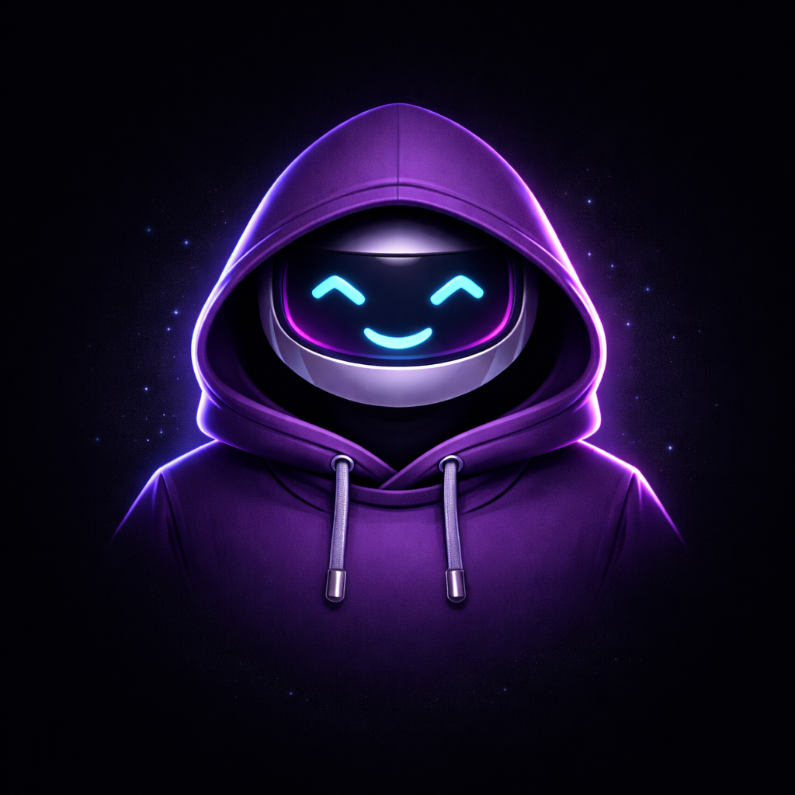
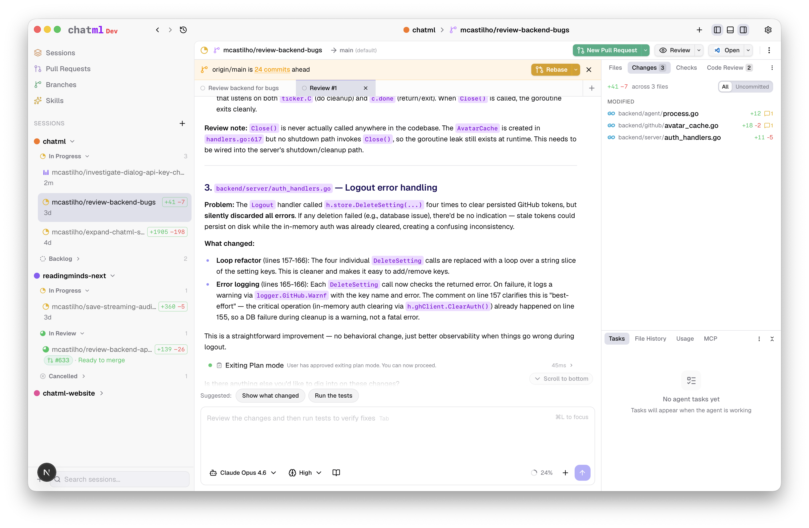

<p align="center">
  
</p>

<h1 align="center">ChatML</h1>

<p align="center">
  <strong>Run AI coding agents in parallel. Each task gets its own worktree.</strong>
</p>

<p align="center">
  <a href="https://github.com/chatml/chatml/releases"></a>
  <a href="LICENSE"></a>
  <a href="https://github.com/chatml/chatml/actions/workflows/ci.yml"></a>
  <a href="https://github.com/chatml/chatml/releases"></a>
  <a href="https://x.com/chatmlx"></a>
</p>

<p align="center"></p>

---

ChatML is a native macOS app for AI-assisted development. Instead of chatting with an AI and copy-pasting code, you describe a task and Claude does the work — reading files, writing code, running commands, and creating PRs — all inside an isolated git worktree so nothing touches your working directory.

Spin up five sessions at once: one refactoring auth, one adding an API endpoint, one fixing a bug, one writing tests, one reviewing a PR. They all run in parallel without stepping on each other.

## How It Works

```
1. Add a repo          →  Register any git repository as a workspace
2. Create a session    →  ChatML creates an isolated worktree + branch
3. Describe the task   →  Claude writes, edits, and runs code directly
4. Review & merge      →  Check the diff, open a PR, done
```

Sessions are fully isolated. Each one gets its own branch, its own working directory, and its own AI agent. No merge conflicts between parallel tasks.

## Download

**[Download the latest release](https://github.com/chatml/chatml/releases)** (.dmg for macOS)

Or build from source:

```bash
git clone https://github.com/chatml/chatml.git && cd chatml && make dev
```

You'll need an [Anthropic API key](https://console.anthropic.com/) — the onboarding wizard will walk you through setup.

## Key Features

### Worktree-Isolated Sessions

Every session creates a `git worktree` with its own branch and working directory. Sessions are fully isolated — no merge conflicts between parallel tasks, no accidentally committing to the wrong branch.

### Full Agent Autonomy

Powered by the [Claude Agent SDK](https://docs.anthropic.com). Claude has full tool access within each session: reading and writing files, running terminal commands, searching the codebase, and executing multi-step workflows. Watch everything happen in real time — text streams as it's generated, tool calls show their status and duration, sub-agents are tracked independently.

### Built-In Code Review

Start a review conversation and Claude examines the session's changes with inline comments, severity levels, and resolution tracking.

### Pull Requests & CI/CD

Push a branch and create a GitHub PR without leaving the app. Claude generates PR descriptions from the diff. Live status polling tracks checks, merge conflicts, and review state. View GitHub Actions runs, drill into job logs, and let Claude analyze failures.

### Skills Marketplace

25+ specialized prompt templates: TDD guidance, security audits, systematic debugging, architecture decision records, and more. Install per-session, or create your own.

### Budget & Context Controls

Set cost limits, turn limits, and thinking token budgets. Monitor context window utilization and token usage in real time. Automatic git stash-based checkpoints let you revert to any previous state.

---

<details>
<summary><strong>All Features</strong></summary>

- **File browser & editor** — Session-scoped tabs, syntax highlighting, side-by-side diffs, direct editing
- **Terminal integration** — Full PTY terminal emulation, up to 5 terminals per session
- **Extended thinking & plan mode** — Control how deeply Claude reasons before acting
- **Linear integration** — OAuth-based issue discovery, context, and management
- **MCP support** — Built-in server + custom MCP server configuration (stdio, SSE, HTTP)
- **Session management** — Priority, status tracking, pinning, archiving with AI-generated summaries
- **Branch sync** — Detect when behind `origin/main`, sync via rebase or merge
- **Checkpointing & rewind** — Automatic checkpoints, revert files to any previous state
- **Keyboard shortcuts** — 30+ shortcuts for fast navigation
- **Auto-update** — Automatic update detection and installation

</details>

## How It Compares

| | ChatML | Cursor / Windsurf | Claude Code CLI | GitHub Copilot |
|---|---|---|---|---|
| **Parallel tasks** | Each task in its own worktree | Single workspace | Single terminal session | Single file context |
| **Agent autonomy** | Full tool access: file I/O, terminal, git | Editor-integrated suggestions | Full tool access | Inline completions |
| **Code review** | Built-in with inline comments | External | External | External |
| **CI/CD monitoring** | GitHub Actions integration | External | External | External |
| **PR workflow** | Create, track, merge natively | External | External | GitHub integration |
| **Open source** | GPL-3.0 | Proprietary | Proprietary | Proprietary |

## Architecture

ChatML is a polyglot app with four layers:

```
┌─────────────────────────────────────────────┐
│              Tauri 2 (Rust)                 │
│         Native macOS Desktop Shell          │
│                                             │
│  ┌───────────────┐  ┌───────────────────┐   │
│  │  Next.js 15   │  │   Go Backend      │   │
│  │  React 19     │◄─►  REST + WebSocket │   │
│  │  Tailwind 4   │  │  SQLite           │   │
│  │  Zustand      │  │  Git Operations   │   │
│  └───────────────┘  └────────┬──────────┘   │
│                              │              │
│                     ┌────────▼──────────┐   │
│                     │  Agent Runner     │   │
│                     │  Node.js + Claude │   │
│                     │  Agent SDK        │   │
│                     └───────────────────┘   │
└─────────────────────────────────────────────┘
```

| Layer | Tech | Role |
|-------|------|------|
| **Desktop Shell** | Tauri 2, Rust | Native window, menus, PTY, secure storage, auto-update |
| **Frontend** | Next.js 15, React 19, Tailwind CSS 4 | UI, state management, WebSocket client |
| **Backend** | Go, SQLite | REST API, WebSocket, git operations, agent lifecycle |
| **Agent Runner** | Node.js, Claude Agent SDK | AI agent processes, tool execution, streaming |

For deeper technical details, see the [architecture documentation](docs/overview.md).

## Contributing

We welcome contributions! Whether it's bug fixes, new features, documentation, or design work — there's plenty to do.

```bash
# Fork the repo, then:
git clone https://github.com/YOUR_USERNAME/chatml.git
cd chatml
make dev
```

See [CONTRIBUTING.md](CONTRIBUTING.md) for the full development setup, OAuth configuration, and PR process.

### Areas Where Help is Needed

- **Cross-platform support** — Linux and Windows builds
- **Testing** — Frontend component tests, E2E tests
- **Multi-model support** — Providers beyond Claude
- **Documentation** — Guides, tutorials, API docs
- **UI/UX** — Design improvements, accessibility
- **Agent capabilities** — New skills, MCP integrations

Looking for a place to start? Check [good first issues](https://github.com/chatml/chatml/labels/good%20first%20issue).

### CLA Requirement

We require all contributors to sign a [Contributor License Agreement](CLA.md) before we can accept contributions. This is handled automatically when you open your first PR.

## Roadmap

- [ ] **Linux & Windows support** — Cross-platform desktop builds
- [ ] **Multi-model support** — Use different AI providers beyond Claude
- [ ] **Team collaboration** — Shared workspaces and session handoff
- [ ] **Plugin system** — Community-built skills and integrations
- [ ] **Self-hosted backend** — Run the backend as a standalone server
- [ ] **Voice interaction** — Talk to your agent

Want to help with any of these? [Open an issue](https://github.com/chatml/chatml/issues) or jump into a [discussion](https://github.com/chatml/chatml/discussions).

## Security

API keys are stored encrypted with AES-256-GCM. Agent sessions run in isolated worktrees. No telemetry. All communication stays on localhost.

See [SECURITY.md](SECURITY.md) for our security policy and how to report vulnerabilities.

## License

ChatML is licensed under the [GNU General Public License v3.0](LICENSE). You are free to use, modify, and distribute this software, provided that derivative works are distributed under the same license.

---

<p align="center">⭐ If you find this interesting, please star the repo.</p>

<p align="center">
  Built with obsessive attention to developer workflow.<br />
  <a href="https://github.com/chatml/chatml/issues">Report a Bug</a> · <a href="https://github.com/chatml/chatml/issues">Request a Feature</a> · <a href="https://github.com/chatml/chatml/discussions">Discussions</a> · <a href="https://x.com/chatmlx">@chatmlx</a>
</p>
