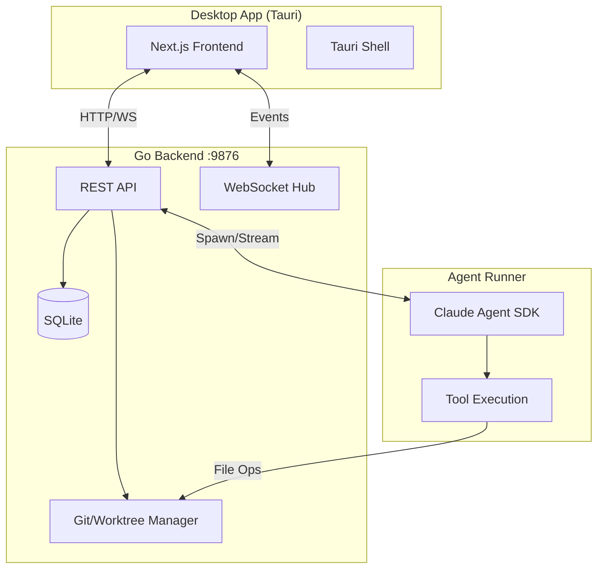
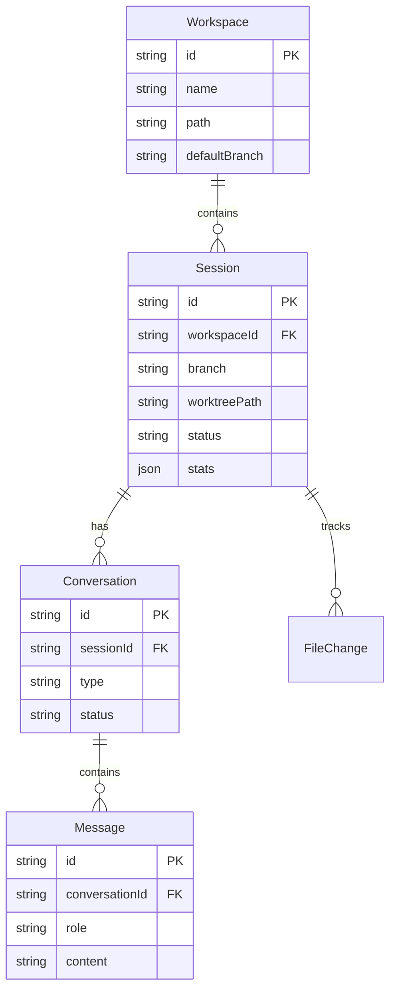
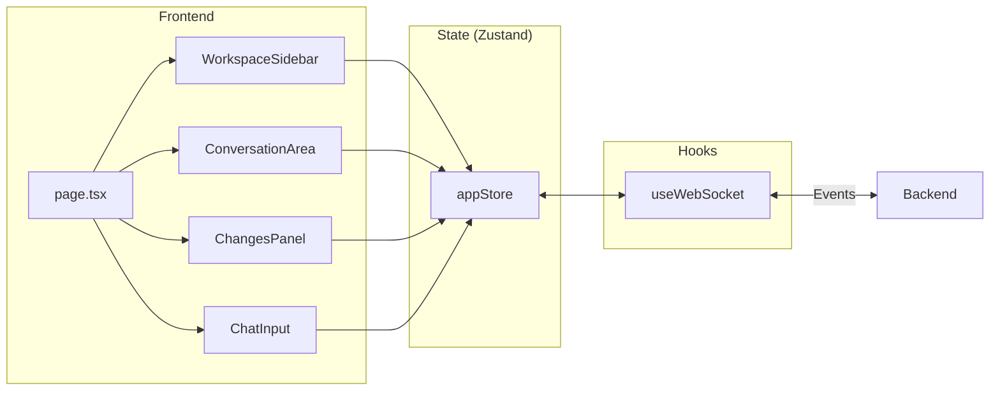

# ChatML

A native desktop application for AI-assisted software development using Claude. ChatML provides isolated git worktree sessions for each task, enabling parallel development workflows with full conversation context.

## Overview

ChatML combines a modern React frontend with a Go backend and Claude Agent SDK integration to create an intelligent development environment. Each coding session runs in an isolated git worktree, allowing you to work on multiple features simultaneously without branch conflicts.



## Features

- **Worktree Sessions** - Each task runs in an isolated git worktree for parallel development
- **Claude Integration** - Native Claude Agent SDK with streaming responses and tool use
- **Real-time Updates** - WebSocket-powered live updates for agent activity
- **Git Diff Visualization** - Side-by-side and inline diff views for code changes
- **File Browser** - Navigate and edit files with syntax highlighting
- **Session Management** - Pin, archive, and track progress across sessions
- **PR Workflow** - Create and track pull requests directly from sessions

## Architecture

### Data Model



### Component Architecture



## Tech Stack

### Frontend
- **[Next.js 15](https://nextjs.org)** - React framework with App Router
- **[React 19](https://react.dev)** - UI library
- **[Tailwind CSS 4](https://tailwindcss.com)** - Utility-first styling
- **[Radix UI](https://www.radix-ui.com)** - Accessible component primitives
- **[Zustand](https://github.com/pmndrs/zustand)** - Lightweight state management
- **[Shiki](https://shiki.style)** - Syntax highlighting

### Backend
- **[Go](https://go.dev)** - Backend API server
- **[SQLite](https://sqlite.org)** - Local data persistence
- **[Gorilla WebSocket](https://github.com/gorilla/websocket)** - Real-time communication

### Desktop
- **[Tauri 2](https://tauri.app)** - Native desktop wrapper
- **[Rust](https://www.rust-lang.org)** - Tauri runtime

### Agent
- **[Claude Agent SDK](https://docs.anthropic.com)** - AI agent framework
- **[Node.js](https://nodejs.org)** - Agent runner runtime

## Prerequisites

- [Node.js](https://nodejs.org) v20+
- [Go](https://go.dev) 1.22+
- [Rust](https://www.rust-lang.org/tools/install) (for Tauri)
- [Tauri CLI](https://tauri.app/start/prerequisites/)

## Getting Started

1. **Clone the repository**
   ```bash
   git clone https://github.com/chatml/chatml.git
   cd chatml
   ```

2. **Install dependencies**
   ```bash
   npm install
   cd agent-runner && npm install && cd ..
   ```

3. **Build the backend**
   ```bash
   cd backend && go build -o chatml-backend && cd ..
   ```

4. **Run in development**
   ```bash
   npm run tauri:dev
   ```

## Project Structure

```
chatml/
├── src/                      # Next.js frontend
│   ├── app/                  # App router pages
│   ├── components/           # React components
│   │   ├── WorkspaceSidebar  # Session navigation
│   │   ├── ConversationArea  # Chat interface
│   │   ├── ChangesPanel      # Git diff viewer
│   │   └── ChatInput         # Message composer
│   ├── hooks/                # Custom React hooks
│   ├── lib/                  # Utilities & API client
│   └── stores/               # Zustand state stores
├── backend/                  # Go backend server
│   ├── agent/                # Agent process management
│   ├── git/                  # Git & worktree operations
│   ├── server/               # HTTP handlers & WebSocket
│   └── store/                # SQLite persistence
├── agent-runner/             # Claude Agent SDK runner
│   └── src/                  # TypeScript agent code
├── src-tauri/                # Tauri desktop wrapper
│   ├── src/                  # Rust source
│   └── tauri.conf.json       # Tauri configuration
└── public/                   # Static assets
```

## Scripts

| Command | Description |
|---------|-------------|
| `npm run dev` | Start Next.js dev server |
| `npm run tauri:dev` | Start full Tauri development |
| `npm run tauri:build` | Build production desktop app |
| `npm run build` | Build Next.js for production |
| `npm run lint` | Run ESLint |

## Development

### Frontend
The frontend uses Next.js App Router with React Server Components where appropriate. State is managed with Zustand, and real-time updates flow through WebSocket connections.

### Backend
The Go backend provides REST APIs for CRUD operations and WebSocket connections for streaming agent responses. Data is persisted in SQLite.

### Agent Runner
The agent runner spawns Claude Agent SDK processes for each conversation, streaming tool calls and responses back through the backend.

## License

ChatML is licensed under the [GNU General Public License v3.0](LICENSE).

This means you are free to use, modify, and distribute this software, provided that any derivative works are also distributed under the same license terms. This ensures that ChatML and its derivatives remain free and open source.

### Contributing

We require all contributors to sign a Contributor License Agreement (CLA) before we can accept contributions. This allows us to ensure proper licensing and maintain the project long-term. See [CLA.md](CLA.md) for details.
