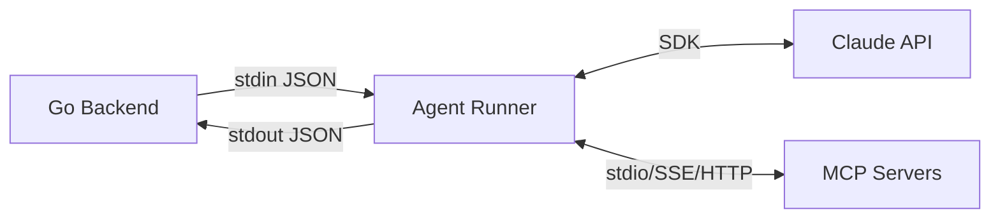
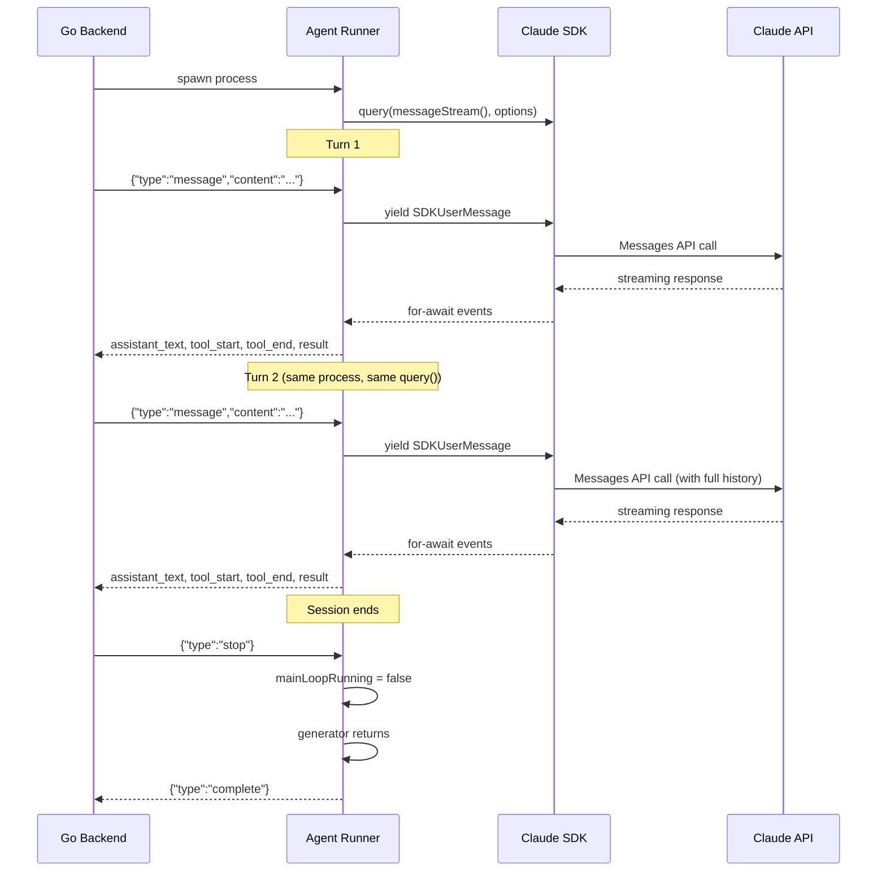
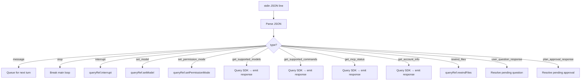

# Claude Agent SDK Integration

## What the Agent Runner Is

The agent runner is a Node.js TypeScript process located at `agent-runner/src/index.ts` (~1,754 lines). It serves as the bridge between the Go backend and the Anthropic Claude API, wrapping the Claude Agent SDK (`@anthropic-ai/claude-agent-sdk`) to provide a multi-turn, streaming conversation experience.

The Go backend spawns one agent-runner process per active conversation. Communication happens via **JSON lines over stdin/stdout** — the backend writes user messages and control commands to the process's stdin, and the agent runner emits streaming events on stdout. Stderr is captured for diagnostics.

The agent runner has four core responsibilities:
1. **Lifecycle management** — Initialize the SDK, maintain the session across turns, handle shutdown
2. **Event translation** — Convert SDK events into JSON events the Go backend understands
3. **Runtime control** — Handle model changes, permission mode switches, interrupts, and file rewinds mid-session
4. **MCP orchestration** — Merge and manage MCP servers from multiple sources



---

## Persistent Multi-Turn Architecture

The most important architectural decision in the agent runner is its use of a **streaming input generator** pattern. Rather than spawning a new process for each turn (which would require `--resume` to reload state), a single `query()` call persists for the entire session lifetime.

An async generator function called `messageStream()` yields user messages to the SDK one at a time. Between yields, the generator blocks waiting for the next message from stdin. The SDK processes each message, generates a response (which the agent runner captures via a `for-await` loop), and then asks the generator for the next message.

This design provides several critical benefits:
- **No subprocess restarts** — The process stays alive across turns, avoiding startup overhead
- **Natural state persistence** — Session state persists in memory without serialization
- **MCP connections stay alive** — MCP servers don't need to reconnect between turns
- **stdin stays open** — Hooks, `canUseTool` callbacks, and MCP servers continue to function



---

## CLI Arguments

The Go backend spawns the agent runner with these command-line arguments:

| Argument | Type | Default | Purpose |
|----------|------|---------|---------|
| `--cwd` | string | `process.cwd()` | Working directory (worktree path) |
| `--conversation-id` | string | `"default"` | Conversation identifier for tracking |
| `--resume` | string | — | SDK session ID to resume from |
| `--fork` | flag | false | Fork the resumed session |
| `--linear-issue` | string | — | Linear issue identifier (e.g., "LIN-123") |
| `--target-branch` | string | — | Base branch for PR operations |
| `--tool-preset` | string | `"full"` | Tool restriction level |
| `--enable-checkpointing` | flag | false | Enable file checkpoint support |
| `--structured-output` | JSON | — | JSON schema for structured responses |
| `--max-budget-usd` | number | — | Maximum cost limit in USD |
| `--max-turns` | number | — | Maximum conversation turn count |
| `--max-thinking-tokens` | number | — | Extended thinking token budget |
| `--permission-mode` | string | `"bypassPermissions"` | Initial permission mode |
| `--setting-sources` | CSV | — | Where to load settings (project, user, local) |
| `--betas` | CSV | — | Beta feature flags |
| `--model` | string | — | Model override |
| `--fallback-model` | string | — | Fallback model if primary unavailable |
| `--instructions-file` | string | — | Path to system prompt file |
| `--mcp-servers-file` | string | — | Path to user-configured MCP servers JSON |
| `--sdk-debug` | flag | false | Enable SDK debugging |
| `--sdk-debug-file` | string | — | Write SDK debug output to file |

---

## Tool Presets

Tool presets restrict which tools the agent can use. They are applied via `allowedTools` and `disallowedTools` in the SDK query options:

| Preset | Allowed Tools | Use Case |
|--------|---------------|----------|
| `full` | All tools | Default — unrestricted access |
| `read-only` | Read, Glob, Grep, WebFetch, WebSearch | Code exploration without modifications |
| `no-bash` | All except Bash | Prevent shell command execution |
| `safe-edit` | Read, Glob, Grep, Edit, WebFetch, WebSearch | File editing without Bash or Write |

---

## Event-Driven Input Queue

Messages from the Go backend arrive as JSON lines on stdin. The agent runner parses each line and routes it based on the `type` field:



The `message` type is the only one that goes through the queue. A `messageQueue` array buffers messages, and a `messageWaiter` callback resolves a pending Promise when a message arrives. If someone is already waiting, the message is delivered immediately; otherwise, it's buffered.

---

## Message Stream Generator

The heart of the multi-turn architecture is the async generator:

```typescript
async function* messageStream(): AsyncGenerator<SDKUserMessage> {
  while (mainLoopRunning) {
    const msg = await waitForNextMessage();  // Blocks until stdin has a message
    if (!msg) break;                          // stdin closed or stop received

    turnCount++;
    currentTurnStartTime = Date.now();
    blockBuffer = "";                         // Reset text buffer
    resetRunStats();                          // Clear tool tracking

    yield buildUserMessage(msg);              // Yield to SDK
    // SDK processes, returns for next iteration
  }
}
```

The generator blocks on `waitForNextMessage()` until a user message arrives (or the stop signal is received). It then yields a single `SDKUserMessage` to the SDK. The SDK processes the message, streams back results through the `for-await` loop, and eventually returns control to the generator, which blocks again waiting for the next message.

---

## Query Initialization

The SDK is initialized with a single `query()` call:

```typescript
const result = query({
  prompt: messageStream(),                    // Streaming input generator
  options: {
    cwd,                                      // Worktree directory
    permissionMode: initialPermissionMode,
    allowDangerouslySkipPermissions: true,
    canUseTool: async () => ({ behavior: "allow" }),
    mcpServers: mergedMcpServers,             // Built-in + .mcp.json + user
    includePartialMessages: true,             // Enable streaming
    tools: { type: "preset", preset: "claude_code" },
    systemPrompt: instructions
      ? { type: "preset", preset: "claude_code", append: instructions }
      : { type: "preset", preset: "claude_code" },
    hooks,                                    // All hooks always enabled
    allowedTools: presetConfig.allowedTools,
    disallowedTools: presetConfig.disallowedTools,
    enableFileCheckpointing: enableCheckpointing,
    outputFormat,                             // Structured output schema
    maxBudgetUsd, maxTurns, maxThinkingTokens,
    model, fallbackModel,
    abortController: sessionAbortController,
    resume: resumeSessionId,
    forkSession,
  },
});
```

Key options:
- **`includePartialMessages: true`** enables streaming text events during generation
- **`canUseTool`** always returns `allow` — actual permission logic lives in the PreToolUse hooks
- **`allowDangerouslySkipPermissions: true`** is required because permission mode can change at runtime
- The **system prompt** uses the `claude_code` preset (built into the SDK) with optional appended instructions from conversation summaries

---

## Hook System

All hooks are always enabled. They provide real-time tracking of every agent activity:

### PreToolUse Hooks

**AskUserQuestion** (24-hour timeout): When Claude uses the `AskUserQuestion` tool, the hook intercepts it, emits a `user_question_request` event to the Go backend, and blocks on a Promise until the user responds. The 24-hour timeout gives users unlimited practical time to answer.

**ExitPlanMode** (24-hour timeout): When Claude uses `ExitPlanMode`, the hook emits a `plan_approval_request` event and blocks until the user approves or rejects the plan.

**Default** (all other tools): Emits a `hook_pre_tool` event for tracking. For sub-agent tools, also tracks the tool start with the agent ID.

### PostToolUse Hook

Tracks tool completion, calculates duration from start time, and emits a `hook_post_tool` event. For sub-agent tools, emits `tool_end` with the agent ID.

### PostToolUseFailure Hook

Tracks failed tools, emits failure events, and cleans up sub-agent tool tracking.

### Other Hooks

- **Notification** — Emits `agent_notification` events (title, message, type)
- **SessionStart** — Updates `currentSessionId`, emits `session_started`
- **SessionEnd** — Emits `session_ended` with reason
- **Stop** — Emits `agent_stop` event
- **SubagentStart** — Maps session ID to agent ID for correlation, finds parent Task tool
- **SubagentStop** — Cleans up session-to-agent mapping, emits `subagent_stopped`

---

## Output Event Types

All events are emitted as JSON lines on stdout via `console.log(JSON.stringify(event))`:

### Lifecycle Events
- `ready` — Process initialized and ready for messages
- `init` — SDK configuration (model, tools, MCP servers, budget config)
- `session_started` / `session_ended` — Session lifecycle
- `session_id_update` — SDK session ID changed (for resume)
- `turn_complete` — Turn finished, process stays alive for next message
- `complete` — Session ended, process will exit

### Content Events
- `assistant_text` — Streamed text content (paragraph-buffered)
- `thinking_start` / `thinking_delta` / `thinking` — Extended thinking blocks

### Tool Events
- `tool_start` — Tool invocation begins (with params)
- `tool_end` — Tool completed (success/failure, summary, duration)
- `tool_progress` — Elapsed time update for long-running tools

### Sub-Agent Events
- `subagent_started` — Child agent spawned (with agentId, agentType, parentToolUseId)
- `subagent_stopped` — Child agent completed

### Interactive Events
- `user_question_request` — AskUserQuestion waiting for user input
- `plan_approval_request` — ExitPlanMode waiting for approval
- `todo_update` — TodoWrite tool updated the task list

### Result Events
- `result` — Turn summary with cost, usage, stats, success/error status
- `context_usage` — Per-message token counts
- `context_window_size` — Model context window info
- `compact_boundary` — Context compaction occurred

### Checkpoint Events
- `checkpoint_created` — File snapshot created (with UUID)
- `files_rewound` — Files restored to checkpoint

### State Change Events
- `model_changed` — Model switched via set_model
- `permission_mode_changed` — Permission mode toggled

### Error Events
- `error` — Fatal error
- `auth_error` — Authentication failure (user-friendly message)
- `interrupted` — Execution interrupted by user
- `shutdown` — Graceful exit with reason

---

## Text Streaming

The agent runner uses block-level buffering to emit text in readable paragraphs rather than character-by-character:

1. Text chunks from the SDK accumulate in a `blockBuffer` string
2. The buffer is split on double newlines (`\n\n`) — paragraph breaks
3. Complete paragraphs are emitted immediately as `assistant_text` events
4. The last incomplete paragraph stays in the buffer
5. If the buffer exceeds **4,096 characters**, a force-flush occurs at the nearest newline
6. At turn boundaries, `flushBlockBuffer()` emits any remaining text

This approach balances streaming responsiveness with readable output — the frontend receives complete paragraphs rather than individual words.

---

## Sub-Agent Tracking

When Claude spawns child agents via the Task tool, the agent runner tracks them for proper event correlation:

- **`sessionToAgentId` Map** — Maps sub-agent session IDs to agent IDs. Populated by `SubagentStartHook`, cleaned up by `SubagentStopHook`
- **`subagentActiveTools` Map** — Tracks tools currently executing in sub-agent context, with agentId for UI attribution

The SubagentStart hook also identifies the **parent Task tool** by iterating through active tools to find the one whose session matches. This `parentToolUseId` lets the frontend nest sub-agent activity under its parent tool call.

Sub-agent text and thinking messages are **skipped** in the main `handleMessage()` function to prevent duplicate output — only the parent agent's content is emitted to the frontend.

---

## Statistics Tracking

Per-turn statistics are tracked and emitted in the `result` event:

| Stat | What It Counts |
|------|---------------|
| `toolCalls` | Total tool invocations |
| `toolsByType` | Breakdown by tool name (e.g., `{"Read": 5, "Write": 2}`) |
| `subAgents` | Number of Task tool invocations |
| `filesRead` | Read, Glob, and Grep invocations |
| `filesWritten` | Write and Edit invocations |
| `bashCommands` | Bash tool invocations |
| `webSearches` | WebSearch and WebFetch invocations |
| `totalToolDurationMs` | Cumulative time spent in tools |

Statistics are reset at the start of each turn and included in the `result` event at the end of the turn.

---

## MCP Integration

The agent runner merges MCP servers from three sources:

### 1. Built-in ChatML MCP Server

The `chatml` MCP server is always available and provides workspace-aware tools:

| Tool | Purpose |
|------|---------|
| `get_session_status` | Current branch, git state, Linear issue |
| `get_workspace_diff` | Git diff summary or full diff |
| `get_recent_activity` | Recent git log entries |
| `add_review_comment` | Post a code review comment |
| `list_review_comments` | List review comments (with optional file filter) |
| `get_review_comment_stats` | Per-file comment counts |
| `get_linear_context` | Current Linear issue details |
| `start_linear_issue` | Create branch from Linear issue |
| `update_linear_status` | Update Linear issue status (local only) |
| `get_workspace_scripts_config` | Read `.chatml/config.json` |
| `propose_scripts_config` | Generate a config proposal for user approval |

These tools use a `WorkspaceContext` class that manages session state: the working directory, workspace ID, session ID, target branch, Linear issue, and git state (current branch, uncommitted changes, ahead/behind counts).

### 2. Project-Level Servers (`.mcp.json`)

If the repository contains a `.mcp.json` file, its servers are loaded and merged. This allows projects to define MCP servers that are always available when working on that codebase.

### 3. Backend-Provided Servers

The Go backend writes user-configured MCP servers to a temporary JSON file and passes its path via `--mcp-servers-file`. These are servers the user has configured through the settings UI. Supported transport types: `stdio`, `sse`, and `http`.

---

## Error Handling

### Auth Error Detection

The agent runner pattern-matches on common authentication error strings: `"authentication_error"`, `"oauth token has expired"`, `"invalid api key"`, `"401 unauthorized"`, and others. When detected, a user-friendly `auth_error` event is emitted instead of a generic error.

### Cleanup Sequence

Graceful shutdown follows a 9-step sequence:
1. Set `mainLoopRunning = false` to break the generator loop
2. Signal the `AbortController` to cancel pending operations
3. Reject all pending user question and plan approval Promises
4. Emit `tool_end` for any in-flight tools (prevents infinite spinners in the UI)
5. Flush the text buffer
6. Call `queryRef.interrupt()` to tear down MCP connections
7. Unblock the message waiter (if blocked on `waitForNextMessage`)
8. Close the readline interface
9. Emit `shutdown` event

### Signal Handlers

- **SIGTERM** / **SIGINT** → cleanup() → `process.exit(0)`
- **Unhandled rejection** → cleanup() → emit error → `process.exit(1)`
- **Uncaught exception** → cleanup() → detect auth errors → emit error → `process.exit(1)`

---

## File Checkpointing

When `--enable-checkpointing` is passed, the SDK creates file checkpoints at turn boundaries:

- Each checkpoint has a UUID that's included in `checkpoint_created` events
- The frontend can later call `rewind_files` with a checkpoint UUID to restore all files to that state
- Checkpoints are created for both user messages (during processing) and result messages (at turn end)
- This enables a "rewind" feature where users can undo unwanted changes within a session

---

## Permission Modes

| Mode | Behavior |
|------|----------|
| `bypassPermissions` | Allow all tools without prompting (default in agent-runner) |
| `default` | Show prompts for sensitive operations |
| `acceptEdits` | Accept file edits automatically, prompt for others |
| `plan` | Agent proposes plans that require user approval |
| `dontAsk` | Never prompt (experimental) |

Permission modes can be changed mid-session via the `set_permission_mode` input message.

---

## Attachment Handling

User messages can include file and image attachments:

- **Images**: Embedded as base64 content blocks with MIME type
- **Files**: Wrapped in `<attached_file>` XML tags with path and line count metadata
- Closing tags (`</attached_file>`) are escaped to prevent XML injection

---

## Cross-References

- **Overview**: See [overview.md](./overview.md) for the application architecture
- **Streaming Events**: See [claude-sdk-events.md](./claude-sdk-events.md) for the event catalog
- **WebSocket Streaming**: See [websocket-streaming.md](./websocket-streaming.md) for the event pipeline
- **Session Management**: See [session-management.md](./session-management.md) for process spawning
