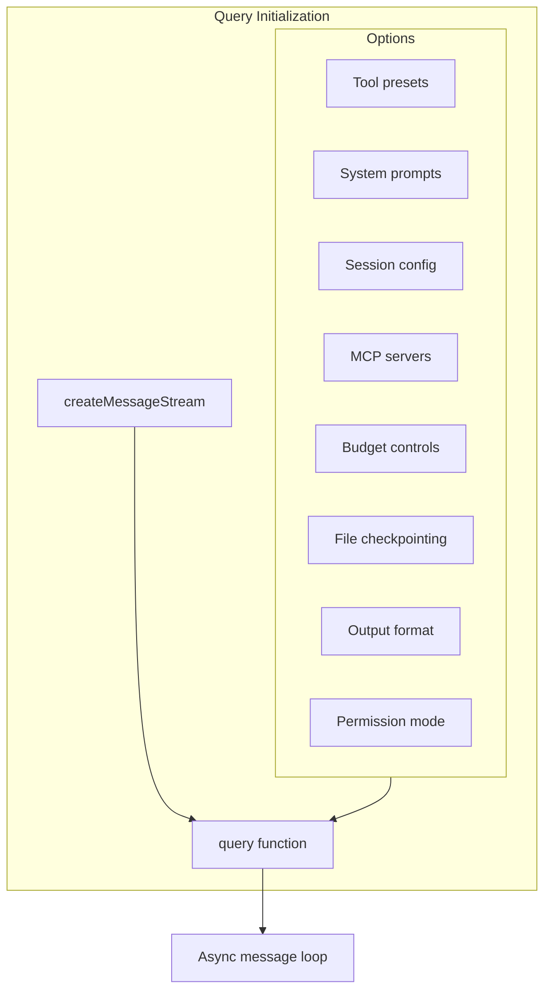
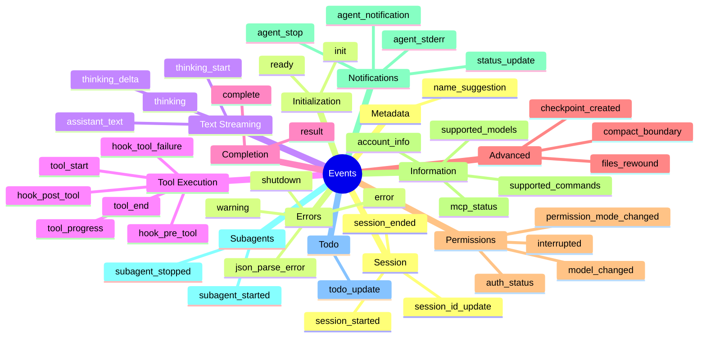
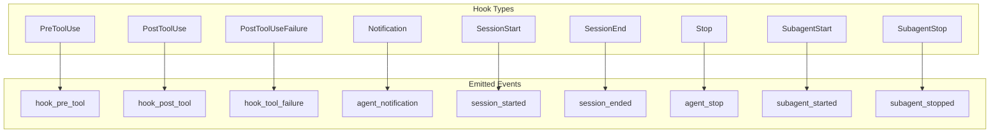
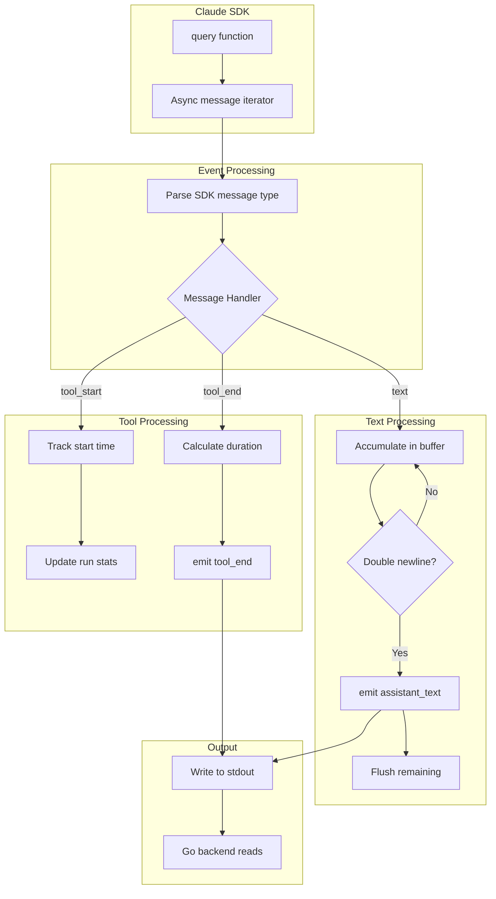
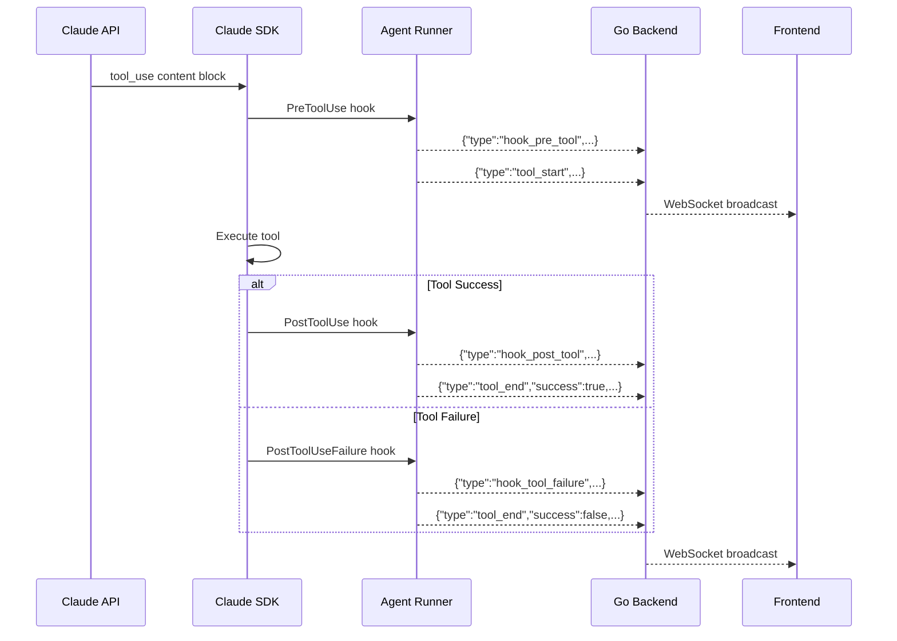

# Claude SDK Events & Callbacks

This document provides a comprehensive reference for all events emitted by the Claude Code SDK integration, including message types, hook callbacks, and the event processing pipeline.

## Table of Contents

1. [SDK Integration Overview](#sdk-integration-overview)
2. [Complete Event Catalog](#complete-event-catalog)
3. [Message Structures](#message-structures)
4. [Hook System](#hook-system)
5. [Event Processing Pipeline](#event-processing-pipeline)
6. [Tool Execution Events](#tool-execution-events)

## SDK Integration Overview

### SDK Imports

**File: `agent-runner/src/index.ts:1-23`**

```typescript
import {
  query,                              // Main query function
  type SDKMessage,                    // Union of all message types
  type SDKUserMessage,               // User input messages
  type SDKResultMessage,             // Completion/error results
  type SDKSystemMessage,             // System initialization
  type SDKCompactBoundaryMessage,    // Context compression events
  type SDKStatusMessage,             // Status updates
  type SDKHookResponseMessage,       // Hook execution results
  type SDKToolProgressMessage,       // Tool execution progress
  type SDKAuthStatusMessage,         // Auth status events
  type Query,                        // Query object for runtime control
  type HookCallback,                 // Hook function type
  // Hook input types...
} from "@anthropic-ai/claude-agent-sdk";
```

### Query Initialization

**File: `agent-runner/src/index.ts:517-555`**



```typescript
const result = await query(
  createMessageStream(),
  {
    tools: { preset: "claude_code", ...toolPresetConfig },
    systemPrompts: { preset: "claude_code" },
    resume: resumeSessionId,
    forkSession: forkSession && !!resumeSessionId,
    mcpServers: { chatml: chatmlMcp },
    maxBudgetUsd: maxBudgetUsd,
    maxTurns: maxTurns,
    maxThinkingTokens: maxThinkingTokens,
    enableFileCheckpointing: enableCheckpointing,
    outputFormat: structuredOutput ? { json_schema: structuredOutput } : undefined,
    permissionMode: "bypassPermissions",
    hooks: hooks,
  }
);
```

## Complete Event Catalog

### All Event Types (47 types)



### Event Reference Table

| Event Type | Trigger | Key Payload Fields | File Line |
|------------|---------|-------------------|-----------|
| `session_started` | SDK session init | `sessionId`, `source`, `cwd` | 422 |
| `session_ended` | SDK session end | `reason`, `sessionId` | 433 |
| `session_id_update` | Session ID changes | `sessionId` | 577 |
| `ready` | Agent runner initialized | - | 495 |
| `init` | SDK provides config | `model`, `tools`, `mcpServers`, `budgetConfig` | 785-809 |
| `assistant_text` | Claude response text | `content` | 291, 307 |
| `thinking` | Complete thinking block | `content` | 594 |
| `thinking_delta` | Thinking text chunk | `content` | 641 |
| `thinking_start` | Thinking begins | - | 648 |
| `tool_start` | Tool execution starts | `id`, `tool`, `params` | 607-611 |
| `tool_end` | Tool execution ends | `id`, `tool`, `success`, `summary`, `duration` | 684-690 |
| `tool_progress` | Tool still running | `id`, `tool`, `elapsed` | 844-850 |
| `result` | Query completes | `success`, `cost`, `turns`, `stats` | 727-778 |
| `complete` | Stream finished | - | 565 |
| `checkpoint_created` | File state saved | `uuid`, `timestamp` | 702-724 |
| `todo_update` | TodoWrite tool used | `todos` | 614-622 |
| `name_suggestion` | AI suggests name | `name` | 299 |
| `error` | Unhandled error | `message`, `stack` | 916 |

## Message Structures

### Input Message Format

**File: `agent-runner/src/index.ts:112-119`**

```typescript
interface InputMessage {
  type: "message"
      | "stop"
      | "interrupt"
      | "set_model"
      | "set_permission_mode"
      | "get_supported_models"
      | "get_supported_commands"
      | "get_mcp_status"
      | "get_account_info"
      | "rewind_files";
  content?: string;           // For "message" type
  model?: string;             // For "set_model" type
  permissionMode?: string;    // For "set_permission_mode" type
  checkpointUuid?: string;    // For "rewind_files" type
}
```

### Output Event Structure

**File: `agent-runner/src/index.ts:103-106`**

```typescript
interface OutputEvent {
  type: string;
  [key: string]: unknown;
}
```

### Key Event Payloads

#### Init Event

```typescript
{
  type: "init",
  model: "claude-sonnet-4-6",
  tools: ["Read", "Write", "Edit", "Bash", "Glob", "Grep", ...],
  mcpServers: [
    { name: "chatml", status: "connected", tools: [...] }
  ],
  slashCommands: ["/commit", "/review-pr", ...],
  skills: ["test-driven-development", "systematic-debugging", ...],
  plugins: [],
  agents: ["Explore", "Plan", "Bash", ...],
  permissionMode: "bypassPermissions",
  claudeCodeVersion: "1.0.21",
  apiKeySource: "env",
  betas: [],
  outputStyle: "verbose",
  sessionId: "abc123",
  cwd: "/path/to/workspace",
  budgetConfig: {
    maxBudgetUsd: 10.0,
    maxTurns: 100,
    maxThinkingTokens: 50000
  }
}
```

#### Tool Start Event

```typescript
{
  type: "tool_start",
  id: "toolu_01ABC123",          // tool_use_id from Claude
  tool: "Read",                   // Tool name
  params: {                       // Tool input parameters
    file_path: "/path/to/file.ts"
  }
}
```

#### Tool End Event

```typescript
{
  type: "tool_end",
  id: "toolu_01ABC123",
  tool: "Read",
  success: true,
  summary: "Read 150 lines from /path/to/file.ts",
  duration: 45                    // milliseconds
}
```

#### Result Event (Success)

```typescript
{
  type: "result",
  success: true,
  subtype: "success",
  summary: "Task completed successfully",
  cost: 0.0234,                   // USD
  turns: 5,
  durationMs: 45000,
  durationApiMs: 32000,
  usage: {
    input_tokens: 15000,
    output_tokens: 3000,
    cache_read_input_tokens: 5000,
    cache_creation_input_tokens: 0
  },
  modelUsage: {
    "claude-sonnet-4-6": { ... }
  },
  structuredOutput: null,         // If outputFormat specified
  sessionId: "abc123",
  stats: {
    toolCalls: 12,
    toolsByType: {
      "Read": 4,
      "Edit": 3,
      "Bash": 2,
      "Grep": 2,
      "Glob": 1
    },
    subAgents: 0,
    filesRead: 4,
    filesWritten: 2,
    bashCommands: 2,
    webSearches: 0,
    totalToolDurationMs: 1234
  }
}
```

#### Result Event (Error)

```typescript
{
  type: "result",
  success: false,
  subtype: "error",
  summary: "API rate limit exceeded",
  errors: [
    {
      type: "rate_limit_error",
      message: "Rate limit exceeded"
    }
  ],
  cost: 0.0012,
  turns: 1,
  durationMs: 1500,
  sessionId: "abc123"
}
```

#### Checkpoint Created Event

```typescript
{
  type: "checkpoint_created",
  uuid: "chk_01ABC123",
  timestamp: "2025-01-15T10:30:00Z",
  files: [
    { path: "src/app.ts", action: "modified" },
    { path: "src/utils.ts", action: "created" }
  ]
}
```

## Hook System

### Available Hooks

**File: `agent-runner/src/index.ts:361-484`**



### Hook Configuration

```typescript
const hooks = {
  PreToolUse: [{ hooks: [preToolUseHook] }],
  PostToolUse: [{ hooks: [postToolUseHook] }],
  PostToolUseFailure: [{ hooks: [postToolUseFailureHook] }],
  Notification: [{ hooks: [notificationHook] }],
  SessionStart: [{ hooks: [sessionStartHook] }],
  SessionEnd: [{ hooks: [sessionEndHook] }],
  Stop: [{ hooks: [stopHook] }],
  SubagentStart: [{ hooks: [subagentStartHook] }],
  SubagentStop: [{ hooks: [subagentStopHook] }],
};
```

### Hook Implementations

#### SessionStart Hook

```typescript
const sessionStartHook: HookCallback = async (input) => {
  const hookInput = input as SessionStartHookInput;
  currentSessionId = hookInput.session_id;
  emit({
    type: "session_started",
    sessionId: hookInput.session_id,
    source: hookInput.source,  // "startup" | "resume" | "clear" | "compact"
    cwd: hookInput.cwd,
  });
};
```

#### PreToolUse Hook

```typescript
const preToolUseHook: HookCallback = async (input) => {
  const hookInput = input as PreToolUseHookInput;
  emit({
    type: "hook_pre_tool",
    tool: hookInput.tool_name,
    params: hookInput.tool_input,
    id: hookInput.tool_use_id,
  });
  return undefined;  // Allow tool execution
};
```

#### PostToolUse Hook

```typescript
const postToolUseHook: HookCallback = async (input) => {
  const hookInput = input as PostToolUseHookInput;
  emit({
    type: "hook_post_tool",
    tool: hookInput.tool_name,
    id: hookInput.tool_use_id,
    result: hookInput.tool_result,
  });
};
```

## Event Processing Pipeline

### Agent Runner Event Flow



### Text Block Streaming

**File: `agent-runner/src/index.ts:275-310`**

```typescript
let blockBuffer = "";
let accumulatedText = "";

function processTextChunk(text: string): void {
  blockBuffer += text;
  accumulatedText += text;

  // Split on paragraph breaks (double newlines)
  const blocks = blockBuffer.split("\n\n");
  blockBuffer = blocks.pop() || "";

  // Emit complete blocks
  for (const block of blocks) {
    if (block.trim()) {
      emit({ type: "assistant_text", content: block + "\n\n" });
    }
  }
}

function flushBlockBuffer(): void {
  if (blockBuffer.trim()) {
    emit({ type: "assistant_text", content: blockBuffer });
    blockBuffer = "";
  }
}
```

### Run Statistics Tracking

**File: `agent-runner/src/index.ts:312-358`**

```typescript
interface RunStats {
  toolCalls: number;
  toolsByType: Record<string, number>;
  subAgents: number;
  filesRead: number;
  filesWritten: number;
  bashCommands: number;
  webSearches: number;
  totalToolDurationMs: number;
}

const activeTools = new Map<string, { tool: string; startTime: number }>();

function trackToolStart(toolName: string, toolId: string): void {
  runStats.toolCalls++;
  runStats.toolsByType[toolName] = (runStats.toolsByType[toolName] || 0) + 1;
  activeTools.set(toolId, { tool: toolName, startTime: Date.now() });

  // Categorize by tool type
  switch (toolName) {
    case "Task": runStats.subAgents++; break;
    case "Bash": runStats.bashCommands++; break;
    case "Read": runStats.filesRead++; break;
    case "Write":
    case "Edit": runStats.filesWritten++; break;
    case "WebSearch": runStats.webSearches++; break;
  }
}

function trackToolEnd(toolId: string): number {
  const toolInfo = activeTools.get(toolId);
  if (toolInfo) {
    const duration = Date.now() - toolInfo.startTime;
    runStats.totalToolDurationMs += duration;
    activeTools.delete(toolId);
    return duration;
  }
  return 0;
}
```

## Tool Execution Events

### Tool Event Timeline



### Tool Progress Events

For long-running tools, progress events are emitted periodically:

```typescript
{
  type: "tool_progress",
  id: "toolu_01ABC123",
  tool: "Bash",
  elapsed: 5000,        // milliseconds since start
  status: "running"
}
```

### Supported Tools

| Tool | Description | Key Parameters |
|------|-------------|----------------|
| `Read` | Read file contents | `file_path`, `offset`, `limit` |
| `Write` | Write file | `file_path`, `content` |
| `Edit` | Edit file section | `file_path`, `old_string`, `new_string` |
| `Bash` | Execute command | `command`, `timeout` |
| `Glob` | Find files by pattern | `pattern`, `path` |
| `Grep` | Search file contents | `pattern`, `path`, `type` |
| `WebSearch` | Search the web | `query` |
| `WebFetch` | Fetch URL content | `url`, `prompt` |
| `Task` | Launch subagent | `prompt`, `subagent_type` |
| `TodoWrite` | Update todo list | `todos` |

## Related Documentation

- [Conversation Architecture Overview](./conversation-architecture.md)
- [WebSocket Streaming](./websocket-streaming.md)
- [Frontend Rendering Pipeline](./frontend-rendering.md)
- [Session Management](./session-management.md)
