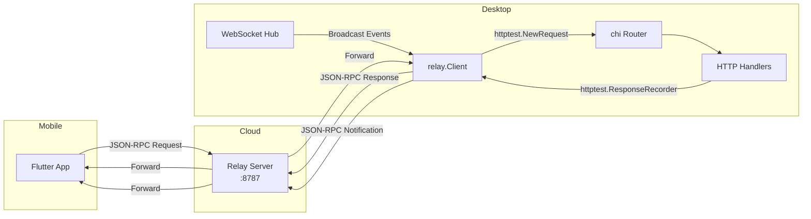
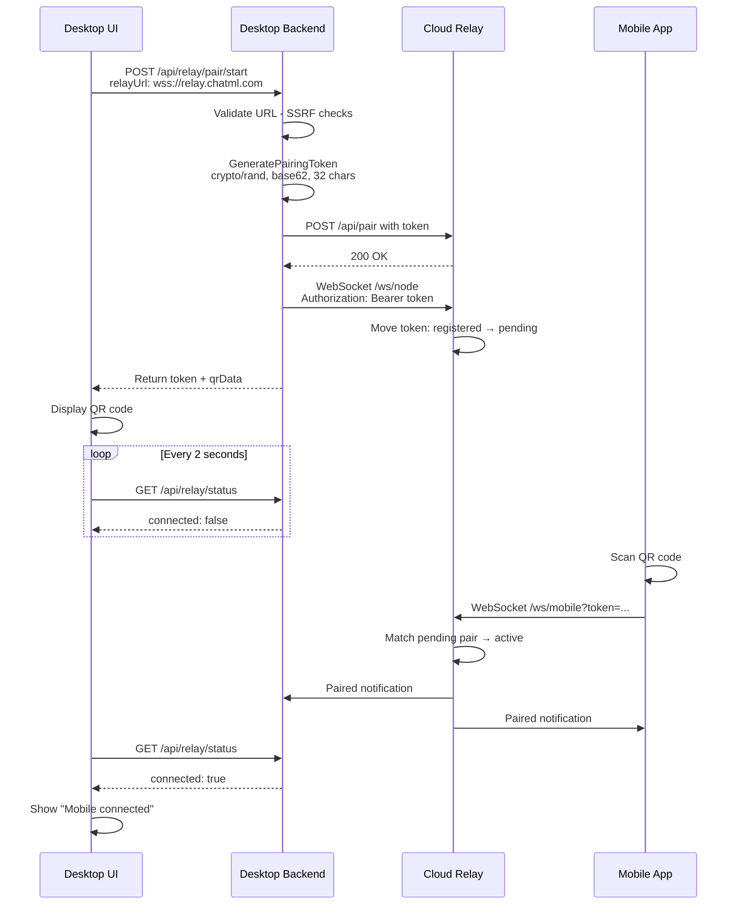
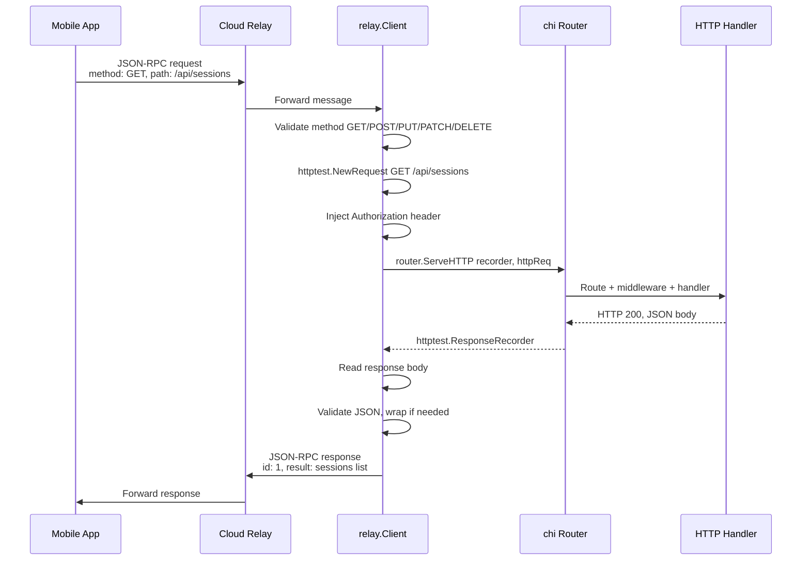
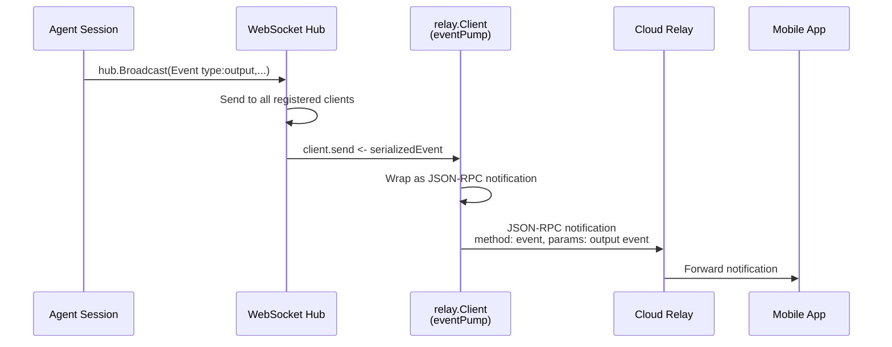
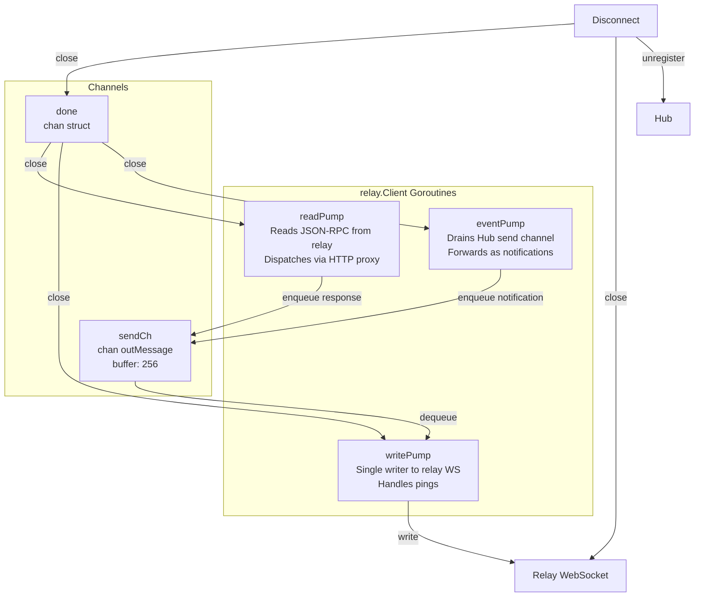
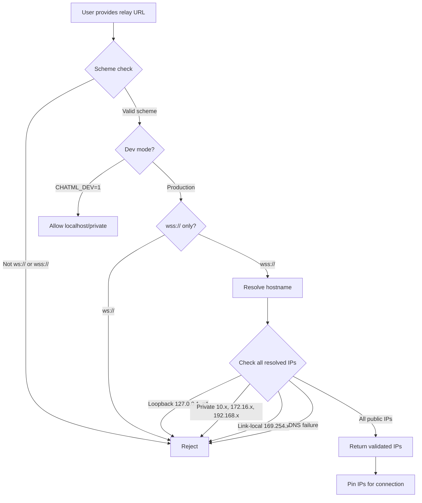

# Cloud Relay — Mobile Remote Control

The Cloud Relay enables mobile devices to remotely control and monitor ChatML desktop sessions through a WebSocket relay server. Instead of rebuilding any backend logic, the relay tunnels the existing REST API and WebSocket events to a Flutter mobile app — zero handler refactoring.

> **Status:** Feature-gated behind `CHATML_RELAY_URL`. The relay infrastructure is implemented but hidden from users until the cloud relay is deployed in production.

---

## Table of Contents

- [Architecture](#architecture)
- [How It Works](#how-it-works)
  - [Pairing Flow](#pairing-flow)
  - [HTTP-over-WebSocket Proxy](#http-over-websocket-proxy)
  - [Event Forwarding](#event-forwarding)
  - [Connection Lifecycle](#connection-lifecycle)
- [JSON-RPC Protocol](#json-rpc-protocol)
- [Security](#security)
  - [SSRF Prevention](#ssrf-prevention)
  - [DNS Rebinding Protection](#dns-rebinding-protection)
  - [Auth & Trust Boundary](#auth--trust-boundary)
  - [Cloud Relay Hardening](#cloud-relay-hardening)
- [File Structure](#file-structure)
- [Configuration](#configuration)
- [Running in Development](#running-in-development)
  - [Start the Dev Relay](#1-start-the-dev-relay)
  - [Start the Desktop Backend](#2-start-the-desktop-backend)
  - [Test with wscat](#3-test-with-wscat)
  - [Test from the UI](#4-test-from-the-ui)
- [Testing](#testing)
  - [Manual Testing Scenarios](#manual-testing-scenarios)
  - [Verifying Event Forwarding](#verifying-event-forwarding)
  - [Permission Flow Testing](#permission-flow-testing)
  - [Disconnect Handling](#disconnect-handling)
- [Deployment](#deployment)
  - [Production Configuration](#production-configuration)
  - [Health Checks](#health-checks)
  - [Graceful Shutdown](#graceful-shutdown)
- [Roadmap](#roadmap)

---

## Architecture

The system consists of three components connected by WebSocket:

```
┌──────────────────┐            ┌───────────────────┐            ┌──────────────────────────────┐
│                  │            │                   │            │                              │
│   Mobile App     │            │   Cloud Relay     │            │   Desktop ChatML             │
│   (Flutter)      │◄──WSS────►│   (Go binary)     │◄──WSS────►│   (Go backend)               │
│                  │            │                   │            │                              │
│   JSON-RPC 2.0   │            │   Stateless       │            │   relay.Client:              │
│   over WebSocket │            │   Forward by      │            │    ├─ Hub subscriber         │
│                  │            │   pairing token   │            │    ├─ HTTP proxy (httptest)   │
│                  │            │   ~500 LOC        │            │    └─ Event forwarder        │
│                  │            │                   │            │                              │
└──────────────────┘            └───────────────────┘            └──────────────────────────────┘
```

**Key architectural insight:** The mobile app doesn't talk to a new API. It sends JSON-RPC requests containing HTTP method/path/body, and the desktop relay client constructs synthetic `httptest` requests, routes them through the existing chi router, captures responses, and sends them back. The router handles all auth, middleware, routing, and serialization — the relay is just a transport layer.



---

## How It Works

### Pairing Flow

Pairing uses a one-time cryptographic token exchanged via QR code. The token has ~190 bits of entropy (32 base62 characters) and expires after 5 minutes.



**QR Code Data Format:**

```
chatml://pair?token=aBcD1234EfGh5678IjKl9012MnOp3456&relay=wss%3A%2F%2Frelay.chatml.com
```

The mobile app parses the `chatml://` deep link, extracts the token and relay URL, and connects to the relay's `/ws/mobile` endpoint.

### HTTP-over-WebSocket Proxy

This is the heart of the system. Instead of building a separate API for mobile, the relay client routes JSON-RPC requests through the existing chi router using Go's `httptest` package.



**Why this works:** The chi router handles all routing, auth middleware, rate limiting, parameter extraction, and response serialization. Handlers don't know or care that the request came from `httptest` instead of a real HTTP connection. The `/ws` WebSocket endpoint fails gracefully (can't upgrade httptest) — events flow through the Hub client instead.

**Allowed HTTP Methods:**

| Method | Allowed |
|--------|---------|
| `GET` | Yes |
| `POST` | Yes |
| `PUT` | Yes |
| `PATCH` | Yes |
| `DELETE` | Yes |
| `CONNECT`, `TRACE`, `HEAD`, etc. | No (returns -32602 error) |

### Event Forwarding

The relay client registers as a programmatic Hub client (no real WebSocket connection) and drains the Hub's broadcast channel. Each event is wrapped as a JSON-RPC notification and forwarded to the mobile app.



The programmatic Hub client is created via `hub.RegisterProgrammaticClient()`, which creates a `*Client` with `conn: nil` and a buffered send channel. The relay's `eventPump` goroutine drains this channel. The existing Hub broadcast loop treats all clients uniformly — it just writes to `client.send`.

### Connection Lifecycle

The relay client uses three goroutines coordinated through a `done` channel and a single-writer pattern:



**Timing Constants:**

| Parameter | Value | Purpose |
|-----------|-------|---------|
| Ping interval | 30s | Keep connection alive |
| Pong wait | 60s | Max time to wait for pong response |
| Write wait | 10s | Timeout per write operation |
| Send buffer | 256 msgs | Non-blocking enqueue buffer |

---

## JSON-RPC Protocol

The relay uses [JSON-RPC 2.0](https://www.jsonrpc.org/specification) as the wire protocol between mobile and desktop.

### Request (Mobile → Desktop)

```json
{
  "jsonrpc": "2.0",
  "id": 1,
  "method": "GET",
  "params": {
    "path": "/api/sessions/abc123/conversations",
    "query": { "limit": "50" },
    "body": null
  }
}
```

| Field | Type | Description |
|-------|------|-------------|
| `jsonrpc` | `string` | Always `"2.0"` |
| `id` | `int \| string` | Request identifier (per JSON-RPC 2.0 spec) |
| `method` | `string` | HTTP method: `GET`, `POST`, `PUT`, `PATCH`, `DELETE` |
| `params.path` | `string` | API route path (e.g., `/api/repos`) |
| `params.body` | `json` | Request body for POST/PUT/PATCH (optional) |
| `params.query` | `map` | Query parameters (optional) |

### Response (Desktop → Mobile)

**Success:**

```json
{
  "jsonrpc": "2.0",
  "id": 1,
  "result": [
    {"id": "abc", "name": "Session 1", "status": "running"},
    {"id": "def", "name": "Session 2", "status": "idle"}
  ]
}
```

**Error:**

```json
{
  "jsonrpc": "2.0",
  "id": 1,
  "error": {
    "code": -32001,
    "message": "HTTP 404: {\"error\":\"not found\"}"
  }
}
```

| Error Code | Meaning |
|------------|---------|
| `-32001` | HTTP 4xx client error |
| `-32002` | HTTP 5xx server error |
| `-32602` | Invalid params (missing path, unsupported method) |
| `-32603` | Internal error (e.g., failed to read response body) |

### Notification (Desktop → Mobile, no response expected)

```json
{
  "jsonrpc": "2.0",
  "method": "event",
  "params": {
    "type": "output",
    "sessionId": "abc123",
    "payload": "Running tests..."
  }
}
```

Notifications have no `id` field. They wrap Hub broadcast events (agent output, status changes, conversation events) and are forwarded in real-time.

### System Notifications

The relay server sends a `paired` notification to both sides when a mobile device connects:

```json
{
  "jsonrpc": "2.0",
  "method": "paired",
  "params": { "token": "aBcD1234..." }
}
```

The desktop relay client ignores notifications (messages without an `id` field) in its `readPump`.

---

## Security

### SSRF Prevention

When the desktop backend connects to a relay URL provided by the user, it validates the URL to prevent Server-Side Request Forgery:



**Implementation:** `backend/server/relay_handlers.go` — `validateRelayURL()` and `resolveAndValidateHost()`.

### DNS Rebinding Protection

After validating the relay URL, the desktop backend pins all subsequent connections (both the HTTP registration request and the WebSocket dial) to the resolved IP addresses. This prevents an attacker from passing validation with a public IP, then rebinding DNS to a private IP before the actual connection:

```go
// Registration uses IP-pinned HTTP transport
httpClient.Transport = newPinnedTransport(resolvedIPs)

// WebSocket dial uses pinned IPs
dialer.NetDialContext = func(ctx context.Context, network, addr string) (net.Conn, error) {
    // Only dials to pre-validated IP addresses
}
```

### Auth & Trust Boundary

The pairing token IS the trust boundary. Anyone who pairs via QR code gets full API access — the same access level as the Tauri desktop shell:

```
Mobile scans QR → gets pairing token → connects to relay → relay client injects CHATML_AUTH_TOKEN →
  → requests pass through TokenAuthMiddleware → full API access
```

There is intentionally no per-request capability scoping. The rationale: the QR code is a physical proximity proof (you need to be in front of the desktop screen to scan it), and the pairing token is one-time use with a 5-minute TTL.

### Cloud Relay Hardening

The relay server (`backend/cmd/relay/main.go`) has different security postures for dev and production:

| Feature | Dev Mode | Production Mode |
|---------|----------|-----------------|
| WebSocket origin check | Accept all | Whitelist via `ALLOWED_ORIGINS` |
| CORS | `Access-Control-Allow-Origin: *` | Echo matched origin + `Vary: Origin` |
| Startup validation | None | Refuses to start without `ALLOWED_ORIGINS` |
| Logging format | Text (human-readable) | JSON (machine-parseable) |
| Log level | Debug | Info |
| Request body limit | 1KB | 1KB |
| Token length limit | 128 chars | 128 chars |
| Max registrations | 1000 | 1000 (configurable) |
| Pairing TTL | 5 minutes | 5 minutes (configurable) |
| Graceful shutdown | SIGINT/SIGTERM | SIGINT/SIGTERM |
| OPTIONS response | 200 OK | 204 No Content |

---

## File Structure

```
backend/
├── cmd/
│   └── relay/
│       └── main.go              # Cloud relay server (standalone binary)
├── relay/
│   ├── types.go                 # JSON-RPC 2.0 protocol types
│   ├── pairing.go               # Token generation, QR code data
│   ├── proxy.go                 # HTTP-over-WebSocket dispatcher
│   └── client.go                # Desktop relay client, message pumps
├── server/
│   ├── relay_handlers.go        # HTTP endpoints, SSRF validation, IP pinning
│   ├── router.go                # Route registration (conditional on CHATML_RELAY_URL)
│   └── websocket.go             # RegisterProgrammaticClient(), SendChan()
└── logger/
    └── logger.go                # Relay logger component

src/
├── components/
│   └── settings/
│       ├── sections/
│       │   └── PairMobileSettings.tsx  # Pairing UI component
│       └── settingsRegistry.ts         # Search registry (relay entry commented out)
└── lib/
    └── api/
        └── settings.ts                 # Relay API client functions
```

### File Summary

| File | Lines | Purpose |
|------|-------|---------|
| `backend/cmd/relay/main.go` | ~500 | Standalone relay server: pairing table, bidirectional WS forwarding, config, graceful shutdown |
| `backend/relay/types.go` | 46 | JSON-RPC protocol type definitions |
| `backend/relay/pairing.go` | 40 | Crypto-random token generation, QR code data construction |
| `backend/relay/proxy.go` | 136 | Constructs httptest requests, routes through chi, captures responses |
| `backend/relay/client.go` | 317 | Relay client: connect, disconnect, readPump, writePump, eventPump |
| `backend/server/relay_handlers.go` | ~360 | StartPairing, CancelPairing, GetStatus, Disconnect, SSRF validation |
| `src/.../PairMobileSettings.tsx` | 222 | Pairing UI: QR display, polling, connection status |

---

## Configuration

### Desktop Backend Environment Variables

| Variable | Required | Default | Description |
|----------|----------|---------|-------------|
| `CHATML_RELAY_URL` | No | _(empty)_ | If set, enables relay endpoints. E.g., `wss://relay.chatml.com` |
| `CHATML_AUTH_TOKEN` | Yes (for auth) | _(empty)_ | Injected into proxied requests for mobile API access |
| `CHATML_DEV` | No | `0` | Set to `1` to allow localhost/private relay URLs |

When `CHATML_RELAY_URL` is empty:
- Relay routes (`/api/relay/*`) are not registered in the chi router
- The `PairMobileSettings` component calls `getRelayStatus()`, gets a 404, and hides itself

### Cloud Relay Server Environment Variables

| Variable | Required | Default | Description |
|----------|----------|---------|-------------|
| `RELAY_ENV` | No | `dev` | `dev` or `production` — controls security posture |
| `PORT` | No | `8787` | HTTP listen port |
| `ALLOWED_ORIGINS` | Prod only | _(empty)_ | Comma-separated origins for CORS/WebSocket. **Required in production.** |
| `MAX_REGISTRATIONS` | No | `1000` | Max concurrent pending token registrations |
| `PAIRING_TTL` | No | `5m` | Token expiry duration (Go duration format) |
| `MAX_BODY_SIZE` | No | `1024` | Max request body bytes for `/api/pair` |
| `SHUTDOWN_TIMEOUT` | No | `15s` | Graceful shutdown deadline |

---

## Running in Development

### 1. Start the Dev Relay

```bash
cd backend
RELAY_ENV=dev go run ./cmd/relay/
```

Output:

```
time=2026-03-22T10:00:00.000-07:00 level=INFO msg="relay server starting" port=8787 env=dev origins=[]
```

The relay is now listening on `ws://localhost:8787`.

### 2. Start the Desktop Backend

In a separate terminal, start the ChatML desktop backend with the relay URL configured:

```bash
CHATML_DEV=1 CHATML_RELAY_URL=ws://localhost:8787 go run .
```

The `CHATML_DEV=1` flag allows connecting to a localhost relay URL (skips SSRF validation). The `CHATML_RELAY_URL` enables the relay API endpoints.

### 3. Test with wscat

You can simulate the full pairing flow using `wscat` (install via `npm install -g wscat`).

**Step 1: Register a token with the relay**

```bash
curl -X POST http://localhost:8787/api/pair \
  -H 'Content-Type: application/json' \
  -d '{"token":"test-token-abc123"}'
# → {"ok":true}
```

**Step 2: Connect as the desktop node**

```bash
wscat -c "ws://localhost:8787/ws/node" \
  -H "Authorization: Bearer test-token-abc123"
# Connected — waiting for mobile
```

**Step 3: Connect as the mobile client (in another terminal)**

```bash
wscat -c "ws://localhost:8787/ws/mobile?token=test-token-abc123"
# Connected — both sides receive:
# {"jsonrpc":"2.0","method":"paired","params":{"token":"test-token-abc123"}}
```

**Step 4: Send a JSON-RPC request from "mobile"**

In the mobile wscat terminal:

```json
{"jsonrpc":"2.0","id":1,"method":"GET","params":{"path":"/api/repos"}}
```

The message is forwarded through the relay to the desktop, which routes it through the chi router and returns the response.

### 4. Test from the UI

1. Open ChatML desktop app
2. Go to **Settings → Account**
3. The "Pair Mobile Device" section should appear (since `CHATML_RELAY_URL` is set)
4. Enter `ws://localhost:8787` as the relay URL
5. Click **Start Pairing**
6. The UI shows the QR code data and polls for connection
7. Connect via wscat as mobile (step 3 above)
8. The UI should update to show "Mobile connected"

### Relay Health Check

```bash
curl http://localhost:8787/health
# → {"active":0,"pending":1,"registered":0,"status":"ok"}
```

---

## Testing

### Manual Testing Scenarios

#### 1. Full API Proxy Test

Connect mobile via wscat, then exercise the existing API:

```json
// List repositories
{"jsonrpc":"2.0","id":1,"method":"GET","params":{"path":"/api/repos"}}

// List sessions for a repo
{"jsonrpc":"2.0","id":2,"method":"GET","params":{"path":"/api/repos/REPO_ID/sessions"}}

// Get conversations in a session
{"jsonrpc":"2.0","id":3,"method":"GET","params":{"path":"/api/sessions/SESSION_ID/conversations"}}

// Send a message with body
{"jsonrpc":"2.0","id":4,"method":"POST","params":{
  "path":"/api/sessions/SESSION_ID/conversations/CONV_ID/messages",
  "body":{"content":"Hello from mobile"}
}}

// With query parameters
{"jsonrpc":"2.0","id":5,"method":"GET","params":{
  "path":"/api/sessions",
  "query":{"status":"running","limit":"10"}
}}
```

#### 2. Error Handling Test

```json
// Missing path → -32602
{"jsonrpc":"2.0","id":10,"method":"GET","params":{}}

// Unsupported method → -32602
{"jsonrpc":"2.0","id":11,"method":"TRACE","params":{"path":"/api/repos"}}

// Non-existent route → -32001 (HTTP 404)
{"jsonrpc":"2.0","id":12,"method":"GET","params":{"path":"/api/nonexistent"}}
```

### Verifying Event Forwarding

1. Connect mobile via wscat
2. Start an agent session from the desktop UI
3. The mobile wscat should receive JSON-RPC notifications:

```json
{"jsonrpc":"2.0","method":"event","params":{"type":"output","sessionId":"abc","payload":"..."}}
{"jsonrpc":"2.0","method":"event","params":{"type":"status","sessionId":"abc","payload":"running"}}
{"jsonrpc":"2.0","method":"event","params":{"type":"conversation_event","conversationId":"xyz","payload":{...}}}
```

### Permission Flow Testing

1. Connect mobile
2. Trigger a tool that requires approval from the desktop
3. Verify the permission request event reaches mobile as a notification
4. Send the approval back from mobile
5. Verify the agent continues

### Disconnect Handling

Test these scenarios:

| Scenario | Expected Behavior |
|----------|-------------------|
| Kill desktop backend | Relay detects node disconnect, closes mobile connection |
| Kill mobile wscat | Relay detects mobile disconnect, closes node connection |
| Kill relay server | Desktop relay client detects disconnect, readPump exits, Disconnect() cleans up |
| Cancel pairing from UI | Desktop sends close message to relay, cleans up state |
| Token expires (5 min) | Relay cleanup loop removes expired pending pair, closes node connection |

### Running Existing Tests

```bash
cd backend && go test ./...
```

The relay is purely additive — existing tests should not be affected.

---

## Deployment

### Production Configuration

```bash
# Required
export RELAY_ENV=production
export ALLOWED_ORIGINS=https://app.chatml.com,chatml://

# Optional (showing defaults)
export PORT=8787
export MAX_REGISTRATIONS=1000
export PAIRING_TTL=5m
export MAX_BODY_SIZE=1024
export SHUTDOWN_TIMEOUT=15s
```

**Build:**

```bash
cd backend
go build -o relay-server ./cmd/relay/
```

**Run:**

```bash
RELAY_ENV=production \
ALLOWED_ORIGINS=https://app.chatml.com \
./relay-server
```

The relay server is stateless and runs as a single binary. TLS is expected to be terminated at the load balancer / ingress layer (not by the relay itself).

### Health Checks

```
GET /health
```

Returns:

```json
{
  "status": "ok",
  "registered": 5,
  "pending": 2,
  "active": 10
}
```

Use this for Kubernetes liveness/readiness probes:

```yaml
livenessProbe:
  httpGet:
    path: /health
    port: 8787
  initialDelaySeconds: 5
  periodSeconds: 10
```

### Graceful Shutdown

On `SIGINT` or `SIGTERM`:

1. All active WebSocket connections are closed (both pending and paired)
2. The cleanup goroutine stops
3. `http.Server.Shutdown()` drains in-flight HTTP requests
4. Process exits after all connections close or `SHUTDOWN_TIMEOUT` expires

This is critical because `http.Server.Shutdown()` does NOT close hijacked connections (WebSockets). The relay explicitly closes all WebSocket connections first to avoid hanging until the timeout on every deploy.

---

## Roadmap

### Completed

- [x] Cloud relay server with dev/production modes
- [x] QR code pairing flow with crypto-random tokens
- [x] HTTP-over-WebSocket proxy via httptest
- [x] Real-time event forwarding via Hub integration
- [x] Desktop pairing UI in Settings
- [x] SSRF prevention and DNS rebinding protection
- [x] IP-pinned connections
- [x] Single-writer goroutine pattern (writePump)
- [x] Graceful shutdown
- [x] Configurable via environment variables
- [x] Feature gate (`CHATML_RELAY_URL`)

### Phase 1: Mobile App Launch

- [ ] **Deploy cloud relay** — Kubernetes deployment with `wss://relay.chatml.com`
- [ ] **Flutter mobile app** — Scan QR, connect to relay, display sessions and conversations
- [ ] **QR code rendering** — Replace text display with actual QR code image (JS library)
- [ ] **Relay auto-reconnect** — Desktop relay client should reconnect on transient failures
- [ ] **Remove feature gate** — Set `CHATML_RELAY_URL` in production builds, uncomment settings registry
- [ ] **Mobile push notifications** — Notify when agent needs approval or completes a task

### Phase 2: Production Hardening

- [ ] **Multi-instance relay** — Redis-backed pairing state for horizontal scaling
- [ ] **Prometheus metrics** — Connection counts, message rates, latency histograms
- [ ] **Rate limiting** — Per-IP rate limits on `/api/pair` to prevent token registration spam
- [ ] **Connection limits** — Max concurrent connections per relay instance
- [ ] **Token rotation** — Periodic token refresh for long-lived sessions
- [ ] **Relay region selection** — Connect to nearest relay for lower latency

### Phase 3: AI-Native PM Layer (Future)

- [ ] **User accounts** — Authentication, persistent sessions across devices
- [ ] **Cloud-synced state** — Session metadata, conversation history in cloud DB
- [ ] **Team collaboration** — Multiple viewers per session, role-based access
- [ ] **AI-powered project management** — Goals → decompose → execute → report cycle
- [ ] **Business model** — Open core (GPL client, proprietary cloud), seat-based SaaS

---

## Appendix: Interface Decoupling

The `relay` package cannot import `server` (circular dependency), so it defines its own interfaces:

```go
// In relay/client.go

type HubRegistrar interface {
    RegisterProgrammaticClient() HubClient
    UnregisterProgrammaticClient(client HubClient)
}

type HubClient interface {
    SendChan() <-chan []byte
}
```

The `server` package bridges the concrete types via an adapter:

```go
// In server/relay_handlers.go

type hubAdapter struct {
    hub *Hub
}

func (a *hubAdapter) RegisterProgrammaticClient() relay.HubClient {
    return a.hub.RegisterProgrammaticClient()
}

func (a *hubAdapter) UnregisterProgrammaticClient(c relay.HubClient) {
    if client, ok := c.(*Client); ok {
        a.hub.UnregisterProgrammaticClient(client)
    }
}
```

This is the standard Go pattern for breaking import cycles between packages that need to reference each other.
