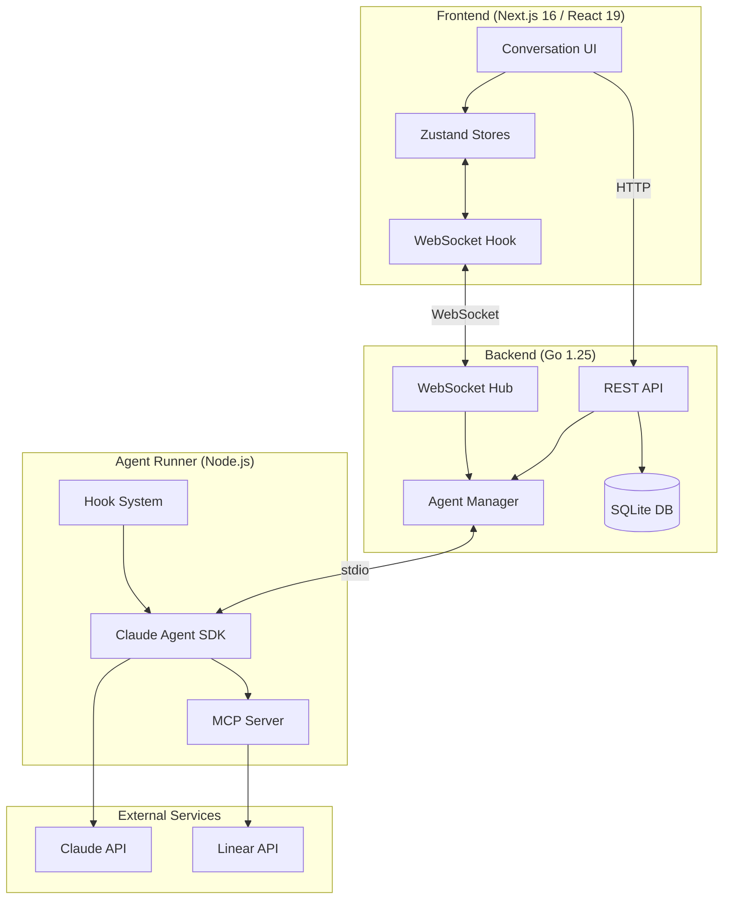
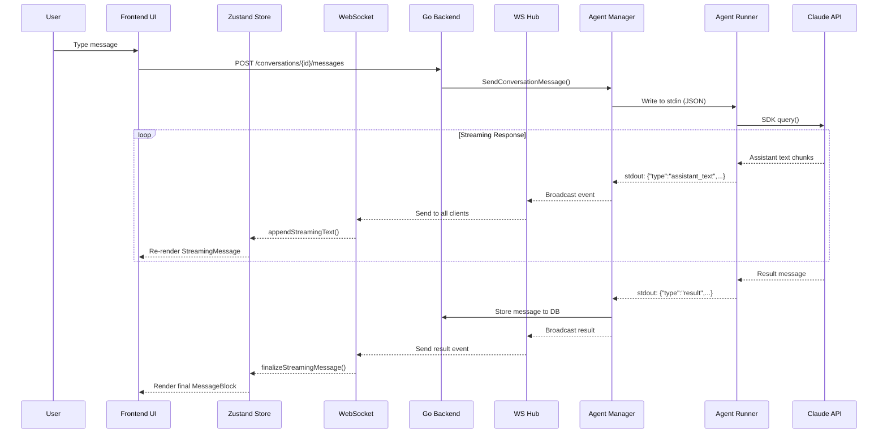
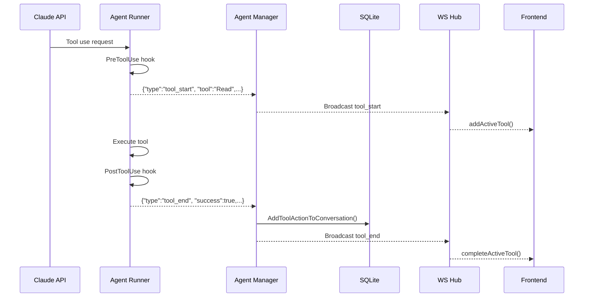

# Conversation Architecture Overview

This document provides a comprehensive overview of the Chat/Conversation feature architecture in ChatML, covering the full stack from frontend rendering to backend persistence.

## Table of Contents

1. [High-Level Architecture](#high-level-architecture)
2. [Component Overview](#component-overview)
3. [Data Flow](#data-flow)
4. [Key Files Reference](#key-files-reference)

## High-Level Architecture

ChatML uses a polyglot architecture with four primary components working together to deliver real-time AI conversations:



## Component Overview

### Frontend Layer

| Component | File | Purpose |
|-----------|------|---------|
| ConversationArea | `src/components/ConversationArea.tsx` | Main chat container, message rendering, search |
| StreamingMessage | `src/components/StreamingMessage.tsx` | Real-time streaming content display |
| MessageBlock | `src/components/ConversationArea.tsx:976` | Individual message rendering |
| appStore | `src/stores/appStore.ts` | Zustand state management |
| useWebSocket | `src/hooks/useWebSocket.ts` | WebSocket connection and event handling |

### Backend Layer

| Component | File | Purpose |
|-----------|------|---------|
| Handlers | `backend/server/handlers.go` | REST API endpoints |
| WebSocket Hub | `backend/server/websocket.go` | Real-time event broadcasting |
| Agent Manager | `backend/agent/manager.go` | Agent process lifecycle |
| SQLite Store | `backend/store/sqlite.go` | Data persistence |
| Event Parser | `backend/agent/parser.go` | Agent event parsing |

### Agent Runner Layer

| Component | File | Purpose |
|-----------|------|---------|
| Main Entry | `agent-runner/src/index.ts` | SDK integration and event emission |
| MCP Server | `agent-runner/src/mcp/server.ts` | Custom tool definitions |
| Context | `agent-runner/src/mcp/context.ts` | Workspace and git state |

## Data Flow

### Complete Request-Response Flow



### Tool Execution Flow



## Key Files Reference

### Frontend

```
src/
├── components/
│   ├── ConversationArea.tsx     # Main conversation view
│   ├── StreamingMessage.tsx     # Real-time streaming display
│   ├── ToolUsageBlock.tsx       # Tool execution display
│   ├── ToolUsageHistory.tsx     # Tool history list
│   └── ConversationTabs.tsx     # Tab management
├── stores/
│   ├── appStore.ts              # Main Zustand store
│   └── selectors.ts             # Optimized selectors
├── hooks/
│   └── useWebSocket.ts          # WebSocket connection
└── lib/
    └── types.ts                 # TypeScript definitions
```

### Backend

```
backend/
├── server/
│   ├── router.go                # API route definitions
│   ├── handlers.go              # Request handlers
│   └── websocket.go             # WebSocket hub
├── agent/
│   ├── manager.go               # Agent lifecycle
│   ├── process.go               # Process spawning
│   └── parser.go                # Event parsing
├── store/
│   └── sqlite.go                # SQLite persistence
└── models/
    └── types.go                 # Data structures
```

### Agent Runner

```
agent-runner/
├── src/
│   ├── index.ts                 # Main entry, SDK integration
│   └── mcp/
│       ├── server.ts            # MCP server definition
│       ├── context.ts           # Workspace context
│       └── tools/
│           ├── linear.ts        # Linear integration
│           └── comments.ts      # Review comments
└── package.json
```

## Related Documentation

- [Data Models & Persistence](./data-models-persistence.md)
- [WebSocket Streaming](./websocket-streaming.md)
- [Claude SDK Events](./claude-sdk-events.md)
- [Frontend Rendering Pipeline](./frontend-rendering.md)
- [Session Management](./session-management.md)
