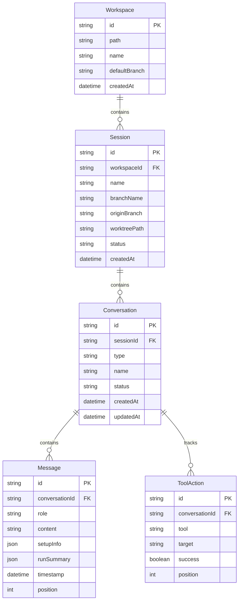
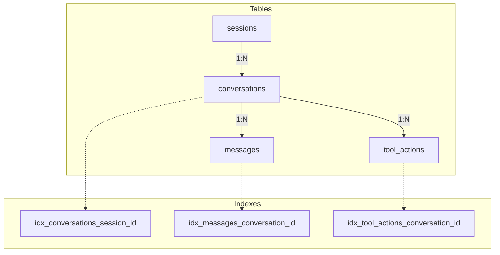
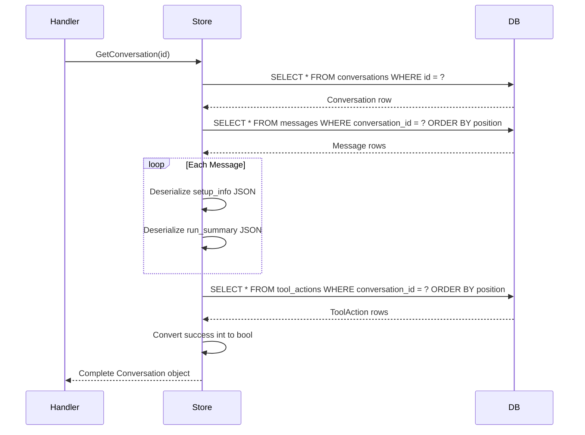
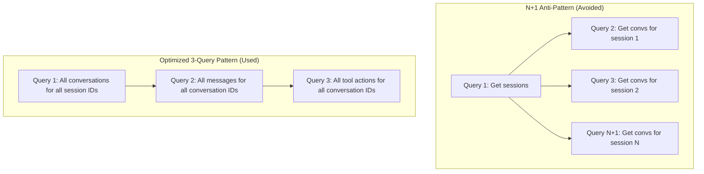
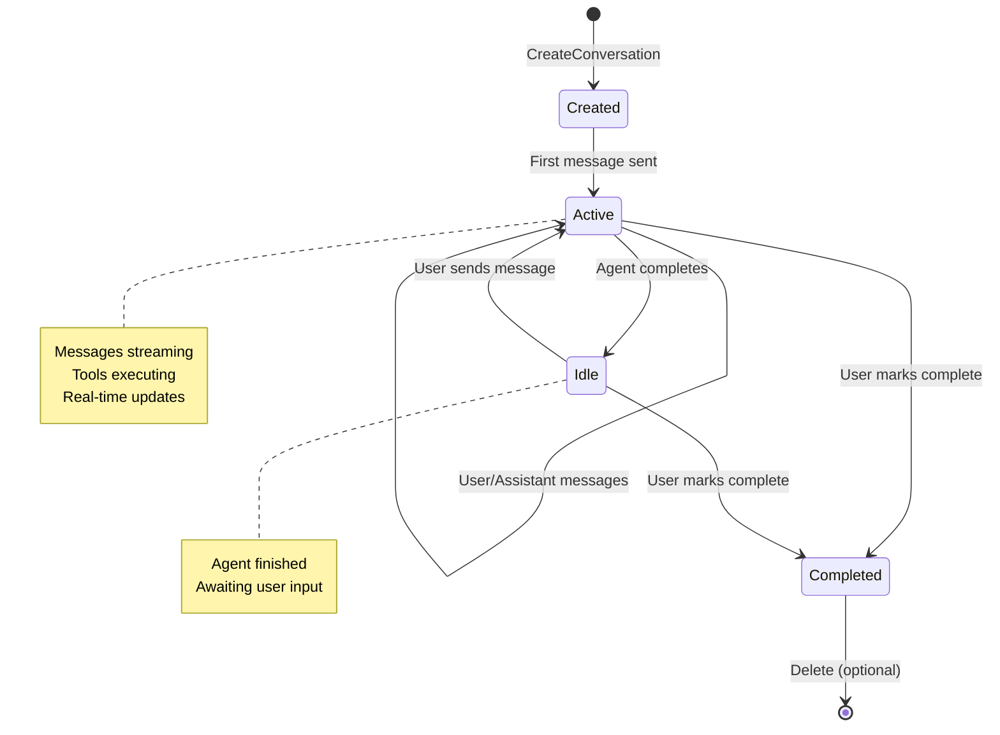

# Data Models & Persistence

This document covers the data model hierarchy, SQLite schema, and persistence patterns used in ChatML's conversation system.

## Table of Contents

1. [Data Model Hierarchy](#data-model-hierarchy)
2. [Core Data Structures](#core-data-structures)
3. [SQLite Schema](#sqlite-schema)
4. [Persistence Patterns](#persistence-patterns)
5. [Query Optimization](#query-optimization)

## Data Model Hierarchy

ChatML uses a hierarchical data model where workspaces contain sessions, sessions contain conversations, and conversations contain messages.



## Core Data Structures

### Conversation (Go)

**File: `backend/models/types.go:69-80`**

```go
type Conversation struct {
    ID          string       `json:"id"`
    SessionID   string       `json:"sessionId"`
    Type        string       `json:"type"`        // "task" | "review" | "chat"
    Name        string       `json:"name"`
    Status      string       `json:"status"`      // "active" | "idle" | "completed"
    Messages    []Message    `json:"messages"`
    ToolSummary []ToolAction `json:"toolSummary"`
    CreatedAt   time.Time    `json:"createdAt"`
    UpdatedAt   time.Time    `json:"updatedAt"`
}
```

### Message (Go)

**File: `backend/models/types.go:113-120`**

```go
type Message struct {
    ID         string     `json:"id"`
    Role       string     `json:"role"`         // "user" | "assistant" | "system"
    Content    string     `json:"content"`
    SetupInfo  *SetupInfo `json:"setupInfo,omitempty"`
    RunSummary *RunSummary `json:"runSummary,omitempty"`
    Timestamp  time.Time  `json:"timestamp"`
}
```

### ToolAction (Go)

**File: `backend/models/types.go:123-128`**

```go
type ToolAction struct {
    ID      string `json:"id"`
    Tool    string `json:"tool"`
    Target  string `json:"target"`    // File path or command
    Success bool   `json:"success"`
}
```

### RunSummary (Go)

**File: `backend/models/types.go:103-110`**

```go
type RunSummary struct {
    Success    bool      `json:"success"`
    Cost       float64   `json:"cost"`       // USD
    Turns      int       `json:"turns"`
    DurationMs int       `json:"durationMs"`
    Stats      *RunStats `json:"stats,omitempty"`
}

type RunStats struct {
    ToolCalls           int            `json:"toolCalls"`
    ToolsByType         map[string]int `json:"toolsByType"`
    SubAgents           int            `json:"subAgents"`
    FilesRead           int            `json:"filesRead"`
    FilesWritten        int            `json:"filesWritten"`
    BashCommands        int            `json:"bashCommands"`
    WebSearches         int            `json:"webSearches"`
    TotalToolDurationMs int            `json:"totalToolDurationMs"`
}
```

### Frontend TypeScript Types

**File: `src/lib/types.ts`**

```typescript
export interface Conversation {
  id: string;
  sessionId: string;
  type: 'task' | 'review' | 'chat';
  name: string;
  status: 'active' | 'idle' | 'completed';
  messages: Message[];
  toolSummary: ToolAction[];
  createdAt: string;
  updatedAt: string;
}

export interface Message {
  id: string;
  role: 'user' | 'assistant' | 'system';
  content: string;
  setupInfo?: SetupInfo;
  runSummary?: RunSummary;
  timestamp: string;
}

export interface ToolAction {
  id: string;
  tool: string;
  target: string;
  success: boolean;
}
```

## SQLite Schema

### Database Configuration

**File: `backend/store/sqlite.go:30-70`**

```go
// Connection settings
- WAL mode enabled for concurrent readers
- 5-second busy timeout for lock contention
- Foreign keys enabled
- 10 max open connections, 5 idle
```

### Table Definitions

**File: `backend/store/sqlite.go:149-207`**

```sql
-- Conversations table
CREATE TABLE conversations (
    id TEXT PRIMARY KEY,
    session_id TEXT NOT NULL,
    type TEXT NOT NULL DEFAULT 'task',
    name TEXT NOT NULL DEFAULT '',
    status TEXT NOT NULL DEFAULT 'active',
    created_at DATETIME NOT NULL,
    updated_at DATETIME NOT NULL,
    FOREIGN KEY (session_id) REFERENCES sessions(id) ON DELETE CASCADE
);
CREATE INDEX idx_conversations_session_id ON conversations(session_id);

-- Messages table (normalized from Conversation.Messages)
CREATE TABLE messages (
    id TEXT PRIMARY KEY,
    conversation_id TEXT NOT NULL,
    role TEXT NOT NULL,
    content TEXT NOT NULL,
    setup_info TEXT DEFAULT NULL,        -- JSON serialized
    run_summary TEXT DEFAULT NULL,       -- JSON serialized
    timestamp DATETIME NOT NULL,
    position INTEGER NOT NULL DEFAULT 0,
    FOREIGN KEY (conversation_id) REFERENCES conversations(id) ON DELETE CASCADE
);
CREATE INDEX idx_messages_conversation_id ON messages(conversation_id);

-- Tool Actions table (normalized from Conversation.ToolSummary)
CREATE TABLE tool_actions (
    id TEXT PRIMARY KEY,
    conversation_id TEXT NOT NULL,
    tool TEXT NOT NULL,
    target TEXT NOT NULL DEFAULT '',
    success INTEGER NOT NULL DEFAULT 1,
    position INTEGER NOT NULL DEFAULT 0,
    FOREIGN KEY (conversation_id) REFERENCES conversations(id) ON DELETE CASCADE
);
CREATE INDEX idx_tool_actions_conversation_id ON tool_actions(conversation_id);
```

### Schema Relationships



## Persistence Patterns

### Adding a Conversation

**File: `backend/store/sqlite.go:851-860`**

```go
func (s *SQLiteStore) AddConversation(ctx context.Context, conv *models.Conversation) error {
    query := `INSERT INTO conversations (id, session_id, type, name, status, created_at, updated_at)
              VALUES (?, ?, ?, ?, ?, ?, ?)`
    return s.RetryDBExec(ctx, query, conv.ID, conv.SessionID, conv.Type,
                         conv.Name, conv.Status, conv.CreatedAt, conv.UpdatedAt)
}
```

### Getting a Conversation with Related Data

**File: `backend/store/sqlite.go:862-939`**



### Adding a Message

**File: `backend/store/sqlite.go:1261-1285`**

```go
func (s *SQLiteStore) AddMessageToConversation(ctx context.Context, convID string, msg Message) error {
    var setupInfoJSON, runSummaryJSON []byte

    if msg.SetupInfo != nil {
        setupInfoJSON, _ = json.Marshal(msg.SetupInfo)
    }
    if msg.RunSummary != nil {
        runSummaryJSON, _ = json.Marshal(msg.RunSummary)
    }

    query := `INSERT INTO messages (id, conversation_id, role, content, setup_info,
              run_summary, timestamp, position)
              SELECT ?, ?, ?, ?, ?, ?, ?, COALESCE(MAX(position), -1) + 1
              FROM messages WHERE conversation_id = ?`

    return s.RetryDBExec(ctx, query, msg.ID, convID, msg.Role, msg.Content,
                         setupInfoJSON, runSummaryJSON, msg.Timestamp, convID)
}
```

## Query Optimization

### Batch Loading for Multiple Sessions

**File: `backend/store/sqlite.go:995-1044`**

The `ListConversationsForSessions` function uses a 3-query pattern to avoid N+1 queries:



```go
func (s *SQLiteStore) ListConversationsForSessions(ctx context.Context, sessionIDs []string) (map[string][]*Conversation, error) {
    // Query 1: All conversations for all sessions
    convQuery := `SELECT id, session_id, type, name, status, created_at, updated_at
                  FROM conversations WHERE session_id IN (?` + strings.Repeat(",?", len(sessionIDs)-1) + `)`

    // Query 2: All messages for all conversations
    msgQuery := `SELECT id, conversation_id, role, content, setup_info, run_summary, timestamp
                 FROM messages WHERE conversation_id IN (?...) ORDER BY position`

    // Query 3: All tool actions for all conversations
    toolQuery := `SELECT id, conversation_id, tool, target, success
                  FROM tool_actions WHERE conversation_id IN (?...) ORDER BY position`

    return result, nil
}
```

### Position-Based Ordering

Messages and tool actions use a `position` column for maintaining order:

```sql
-- Auto-incrementing position on insert
INSERT INTO messages (..., position)
SELECT ..., COALESCE(MAX(position), -1) + 1
FROM messages WHERE conversation_id = ?
```

This ensures messages remain in the correct order even if timestamps are identical.

### Database Resilience

**File: `backend/store/sqlite.go`**

```go
// Retry configuration for transient failures
type RetryConfig struct {
    MaxRetries int
    BaseDelay  time.Duration
    MaxDelay   time.Duration
}

// Default: 3 retries, 10ms base delay, 100ms max
func (s *SQLiteStore) RetryDBExec(ctx context.Context, query string, args ...interface{}) error
```

The store implements exponential backoff for handling SQLite busy errors during high concurrency.

## Data Lifecycle



## Related Documentation

- [Conversation Architecture Overview](./conversation-architecture.md)
- [WebSocket Streaming](./websocket-streaming.md)
- [Session Management](./session-management.md)
