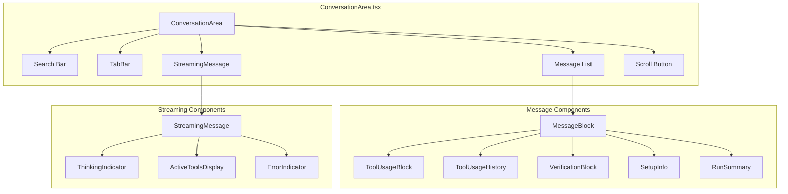
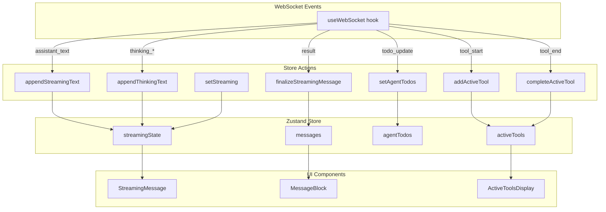
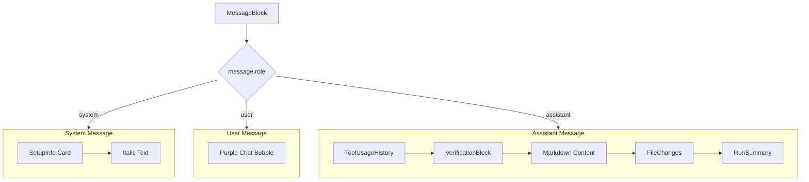
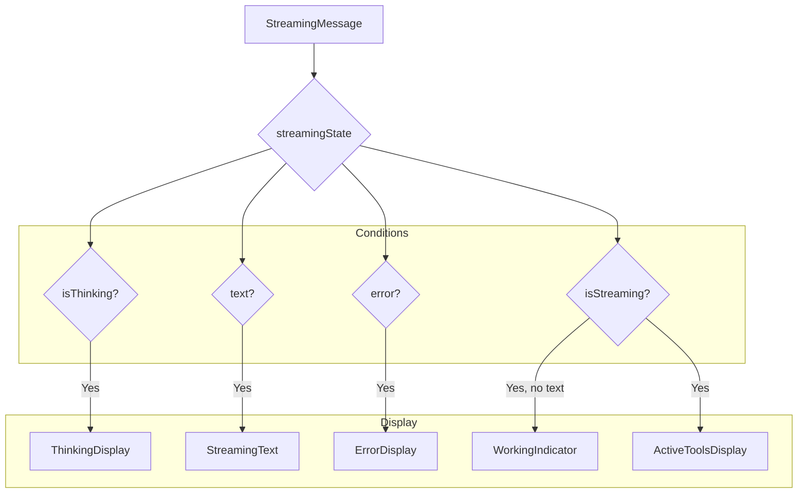
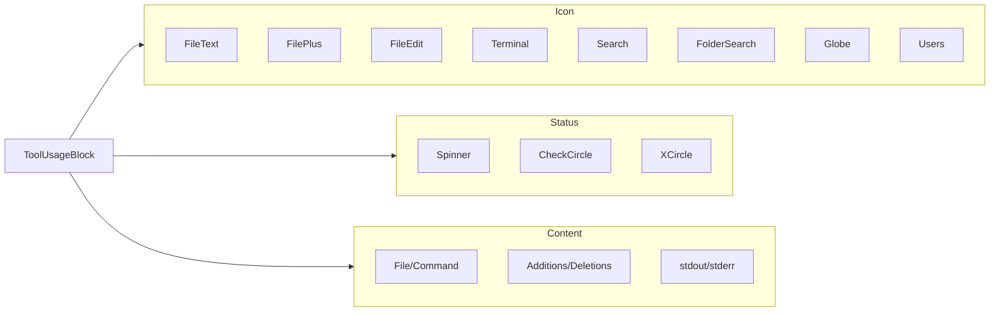
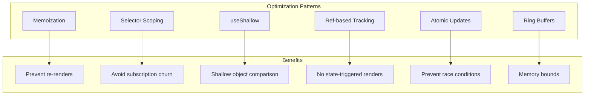
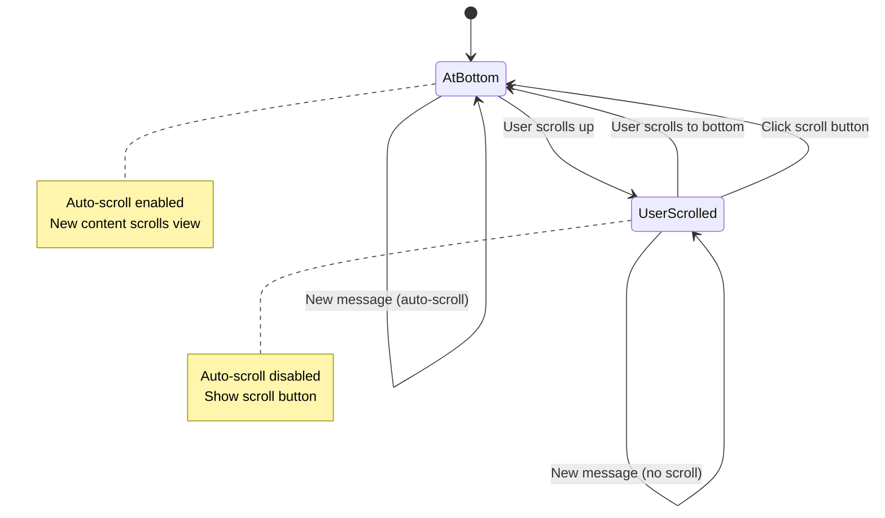
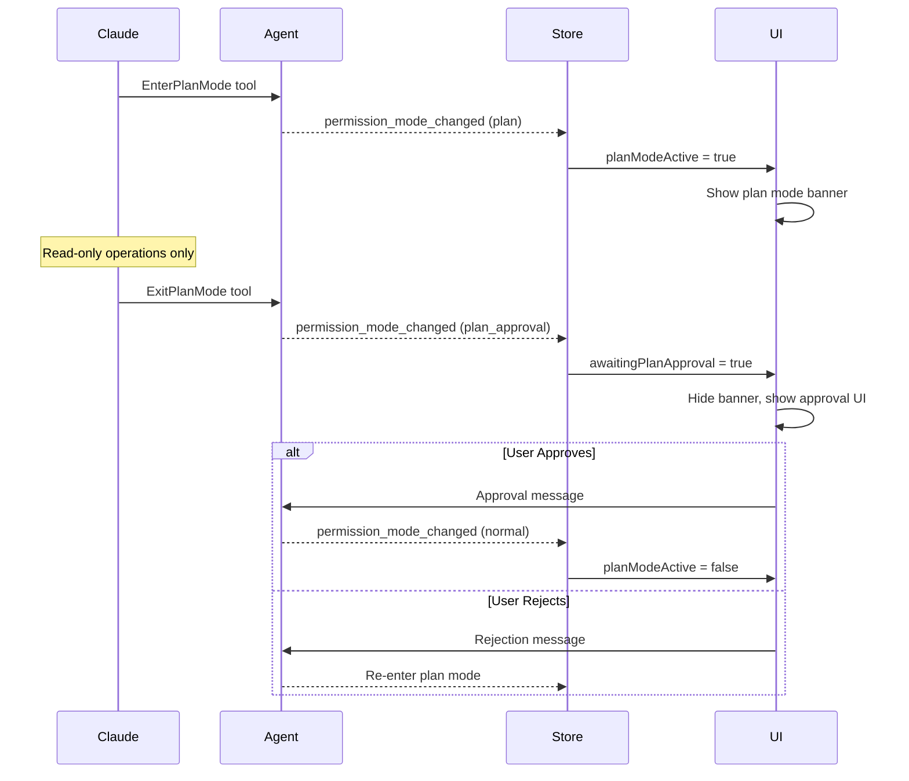

# Frontend Rendering Pipeline

This document covers the frontend message rendering system, including Zustand state management, component architecture, streaming display, and performance optimizations.

## Table of Contents

1. [Component Architecture](#component-architecture)
2. [State Management](#state-management)
3. [Message Rendering](#message-rendering)
4. [Streaming Display](#streaming-display)
5. [Tool Execution Display](#tool-execution-display)
6. [Performance Optimizations](#performance-optimizations)
7. [Auto-Scroll Behavior](#auto-scroll-behavior)

## Component Architecture

### Component Hierarchy



### Key Files

| File | Purpose |
|------|---------|
| `src/components/ConversationArea.tsx` | Main conversation container |
| `src/components/StreamingMessage.tsx` | Real-time streaming display |
| `src/components/ToolUsageBlock.tsx` | Individual tool display |
| `src/components/ToolUsageHistory.tsx` | Tool history list |
| `src/stores/appStore.ts` | Zustand state store |
| `src/stores/selectors.ts` | Optimized state selectors |
| `src/hooks/useWebSocket.ts` | WebSocket connection |

## State Management

### Zustand Store Structure

**File: `src/stores/appStore.ts:54-96`**

```typescript
interface AppState {
  // Conversation State
  conversations: Conversation[];
  messages: Message[];

  // Streaming State (per conversation)
  streamingState: { [conversationId: string]: StreamingState };
  activeTools: { [conversationId: string]: ActiveTool[] };
  agentTodos: { [conversationId: string]: AgentTodoItem[] };

  // UI State
  selectedConversationId: string | null;
  fileTabs: FileTab[];
  // ...
}
```

### StreamingState Interface

**File: `src/stores/appStore.ts:31-40`**

```typescript
interface StreamingState {
  text: string;                    // Accumulated streamed text
  isStreaming: boolean;            // Active streaming flag
  error: string | null;            // Error message if failed
  thinking: string | null;         // Extended thinking content
  isThinking: boolean;             // Thinking in progress
  startTime?: number;              // When streaming started
  planModeActive: boolean;         // Plan mode state
  awaitingPlanApproval: boolean;   // Waiting for ExitPlanMode
}
```

### ActiveTool Interface

```typescript
interface ActiveTool {
  id: string;
  tool: string;
  params: Record<string, unknown>;
  startTime: number;
  endTime?: number;
  success?: boolean;
  summary?: string;
  stdout?: string;
  stderr?: string;
}
```

### State Flow Diagram



### Atomic Message Finalization

**File: `src/stores/appStore.ts:860-914`**

The `finalizeStreamingMessage` action atomically creates a message AND clears streaming state to prevent race conditions:

```typescript
finalizeStreamingMessage: (conversationId, content, runSummary, toolUsage) => {
  set((state) => {
    // 1. Create new message
    const newMessage: Message = {
      id: generateId(),
      role: 'assistant',
      content: content,
      runSummary: runSummary,
      timestamp: new Date().toISOString(),
    };

    // 2. Clear streaming state (preserving planModeActive)
    const currentStreamingState = state.streamingState[conversationId];
    const newStreamingState = {
      text: '',
      isStreaming: false,
      error: null,
      thinking: null,
      isThinking: false,
      startTime: undefined,
      planModeActive: currentStreamingState?.planModeActive || false,
      awaitingPlanApproval: false,
    };

    // 3. Return atomic update
    return {
      messages: [...state.messages, newMessage],
      streamingState: {
        ...state.streamingState,
        [conversationId]: newStreamingState,
      },
      activeTools: {
        ...state.activeTools,
        [conversationId]: [],
      },
    };
  });
},
```

## Message Rendering

### MessageBlock Component

**File: `src/components/ConversationArea.tsx:976-1119`**



### Message Role Styling

| Role | Styling |
|------|---------|
| `user` | Right-aligned, purple background bubble |
| `assistant` | Left-aligned, rich content with tools/code |
| `system` | SetupInfo card or italicized text |

### Markdown Rendering

Assistant messages use ReactMarkdown with syntax highlighting:

```tsx
<ReactMarkdown
  remarkPlugins={[remarkGfm]}
  components={{
    code({ node, inline, className, children, ...props }) {
      const match = /language-(\w+)/.exec(className || '');
      return !inline && match ? (
        <SyntaxHighlighter
          language={match[1]}
          style={vscDarkPlus}
          PreTag="div"
          {...props}
        >
          {String(children).replace(/\n$/, '')}
        </SyntaxHighlighter>
      ) : (
        <code className={className} {...props}>
          {children}
        </code>
      );
    },
  }}
>
  {content}
</ReactMarkdown>
```

## Streaming Display

### StreamingMessage Component

**File: `src/components/StreamingMessage.tsx`**



### Elapsed Time Tracking

**File: `src/components/StreamingMessage.tsx:92-121`**

```tsx
const [elapsedTime, setElapsedTime] = useState<string>('');

useEffect(() => {
  if (!isStreaming || !startTime) {
    setElapsedTime('');
    return;
  }

  const updateElapsed = () => {
    const elapsed = Math.floor((Date.now() - startTime) / 1000);
    const minutes = Math.floor(elapsed / 60);
    const seconds = elapsed % 60;
    setElapsedTime(
      `${minutes.toString().padStart(2, '0')}:${seconds.toString().padStart(2, '0')}`
    );
  };

  updateElapsed();
  const interval = setInterval(updateElapsed, 1000);
  return () => clearInterval(interval);
}, [isStreaming, startTime]);
```

### Extended Thinking Display

**File: `src/components/StreamingMessage.tsx:153-203`**

```tsx
{isThinking && (
  <div className="thinking-container">
    <div className="thinking-header">
      <span className="thinking-indicator">
        <Loader2 className="animate-spin" />
        Extended thinking...
      </span>
      <button onClick={() => setExpanded(!expanded)}>
        {expanded ? <ChevronUp /> : <ChevronDown />}
      </button>
    </div>
    {expanded && thinking && (
      <div className="thinking-content">
        <ReactMarkdown>{thinking}</ReactMarkdown>
      </div>
    )}
  </div>
)}
```

## Tool Execution Display

### ToolUsageBlock Component

**File: `src/components/ToolUsageBlock.tsx:74-84`**



### Tool Icons and Colors

| Tool | Icon | Color |
|------|------|-------|
| `Read` | FileText | Blue |
| `Write` | FilePlus | Green |
| `Edit` | FileEdit | Yellow |
| `Bash` | Terminal | Gray |
| `Grep` | Search | Purple |
| `Glob` | FolderSearch | Cyan |
| `WebSearch` | Globe | Orange |
| `WebFetch` | Download | Orange |
| `Task` | Users | Indigo |

### Active Tools Display

```tsx
const ActiveToolsDisplay = ({ conversationId }: Props) => {
  const activeTools = useActiveTools(conversationId);

  return (
    <div className="active-tools">
      {activeTools.map((tool) => (
        <ToolUsageBlock
          key={tool.id}
          tool={tool.tool}
          params={tool.params}
          isActive={!tool.endTime}
          success={tool.success}
          startTime={tool.startTime}
        />
      ))}
    </div>
  );
};
```

## Performance Optimizations

### Memoization Strategy

**File: `src/components/ConversationArea.tsx:1110-1118`**

```tsx
const MessageBlock = memo(
  ({ message, isLastMessage }: MessageBlockProps) => {
    // Component implementation
  },
  (prevProps, nextProps) => {
    // Custom comparison - only re-render if these change
    return (
      prevProps.message.id === nextProps.message.id &&
      prevProps.message.content === nextProps.message.content &&
      prevProps.isLastMessage === nextProps.isLastMessage
    );
  }
);
```

### Optimized Selectors

**File: `src/stores/selectors.ts`**

```typescript
// Scoped streaming state selector
export const useStreamingState = (conversationId: string) =>
  useAppStore(
    useCallback(
      (state) => state.streamingState[conversationId] || defaultStreamingState,
      [conversationId]
    )
  );

// Scoped active tools selector
export const useActiveTools = (conversationId: string) =>
  useAppStore(
    useCallback(
      (state) => state.activeTools[conversationId] || [],
      [conversationId]
    )
  );

// Messages filtered by conversation with shallow comparison
export const useMessages = (conversationId: string) =>
  useAppStore(
    useShallow((state) =>
      state.messages.filter((m) => m.conversationId === conversationId)
    )
  );
```

### Key Optimization Patterns



### Memory Management

**Session Output Ring Buffer (Line 661)**
```typescript
const MAX_OUTPUT_LINES = 10000;

addSessionOutput: (sessionId, line) => {
  set((state) => {
    const current = state.sessionOutput[sessionId] || [];
    const updated = [...current, line];
    // Ring buffer: keep only last MAX_OUTPUT_LINES
    if (updated.length > MAX_OUTPUT_LINES) {
      updated.splice(0, updated.length - MAX_OUTPUT_LINES);
    }
    return {
      sessionOutput: { ...state.sessionOutput, [sessionId]: updated },
    };
  });
},
```

**Tab LRU Eviction (Lines 538-550)**
```typescript
const MAX_FILE_TABS = 20;

// Auto-close oldest non-pinned, non-dirty tabs
if (fileTabs.length >= MAX_FILE_TABS) {
  const closeable = fileTabs
    .filter((t) => !t.isPinned && !t.isDirty)
    .sort((a, b) => a.lastAccessed - b.lastAccessed);

  if (closeable.length > 0) {
    // Close oldest tab
    return removeFileTab(closeable[0].id);
  }
}
```

## Auto-Scroll Behavior

### Scroll Management

**File: `src/components/ConversationArea.tsx:330-438`**



### Ref-Based Tracking

```typescript
// Refs for scroll tracking (no re-renders)
const scrollContainerRef = useRef<HTMLDivElement>(null);
const isUserScrolledRef = useRef(false);
const wasAtBottomRef = useRef(true);
const [showScrollButton, setShowScrollButton] = useState(false);

// Scroll event handler
const handleScroll = useCallback(() => {
  const container = scrollContainerRef.current;
  if (!container) return;

  const { scrollTop, scrollHeight, clientHeight } = container;
  const isAtBottom = scrollHeight - scrollTop - clientHeight < 50;

  wasAtBottomRef.current = isAtBottom;
  isUserScrolledRef.current = !isAtBottom;
  setShowScrollButton(!isAtBottom);
}, []);

// Auto-scroll on new content
useEffect(() => {
  if (wasAtBottomRef.current && !isUserScrolledRef.current) {
    scrollContainerRef.current?.scrollTo({
      top: scrollContainerRef.current.scrollHeight,
      behavior: 'smooth',
    });
  }
}, [messages, streamingText]);
```

### Force Scroll Function

```typescript
const forceScrollToBottom = useCallback(() => {
  const container = scrollContainerRef.current;
  if (container) {
    container.scrollTo({
      top: container.scrollHeight,
      behavior: 'smooth',
    });
    isUserScrolledRef.current = false;
    wasAtBottomRef.current = true;
    setShowScrollButton(false);
  }
}, []);
```

## Plan Mode UI

### Plan Mode Banner

**File: `src/components/ConversationArea.tsx:828-838`**

```tsx
{streamingState?.planModeActive && !streamingState?.awaitingPlanApproval && (
  <div className="plan-mode-banner">
    <Info className="icon" />
    <span>Claude is in read-only planning mode</span>
  </div>
)}
```

### Plan Mode State Flow



## Related Documentation

- [Conversation Architecture Overview](./conversation-architecture.md)
- [WebSocket Streaming](./websocket-streaming.md)
- [Claude SDK Events](./claude-sdk-events.md)
- [State Management](./data-models-persistence.md)
