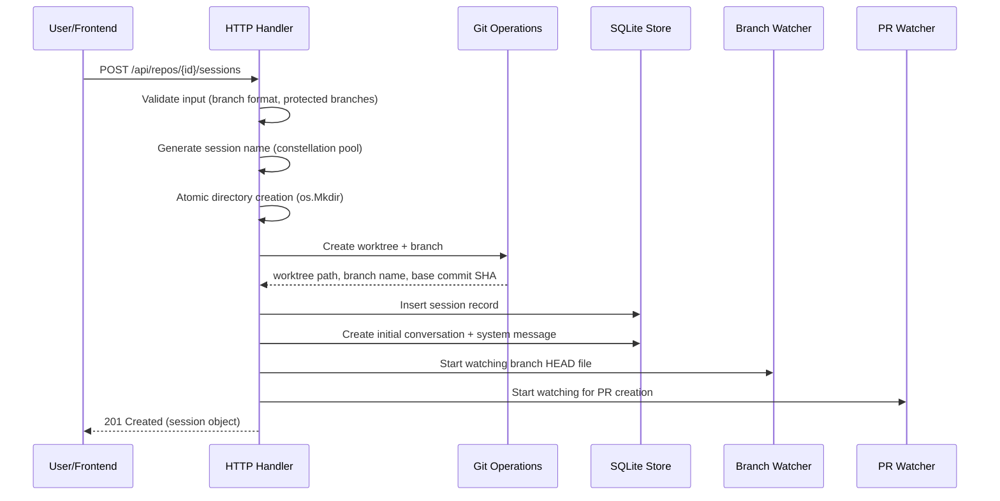
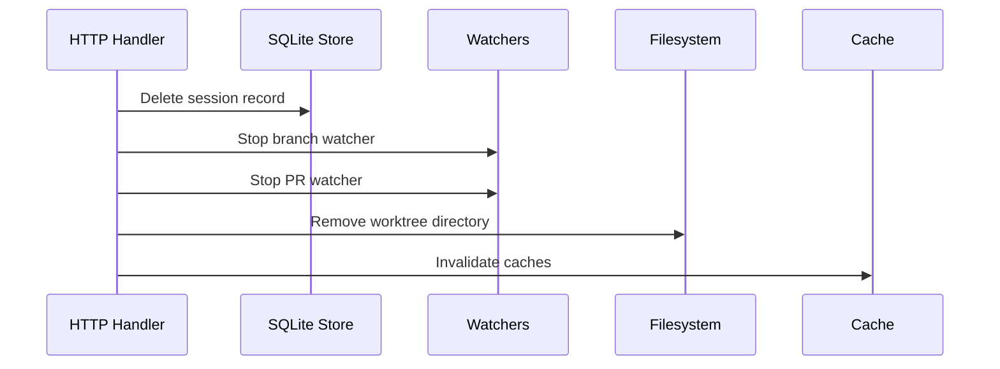

# Git Worktrees and Session Isolation

## What Git Worktrees Are

Git worktrees are a built-in git feature that allows multiple working directories to share a single repository's object database. Each worktree has its own HEAD reference, staging area (index), and working tree, but they all share the same commits, branches, tags, and object store. This means you can have multiple branches checked out simultaneously without cloning the entire repository.

In a regular git repository, the `.git` entry is a directory containing the full object database. In a worktree, however, the `.git` entry is a **file** containing a single line that points back to the main repository:

```
gitdir: /path/to/main/repo/.git/worktrees/<worktree-name>
```

This pointer tells git where to find the shared object database. The main repository keeps track of all its worktrees in `.git/worktrees/`, with each worktree getting its own subdirectory containing its HEAD, index, and other per-worktree state.

The key advantage of worktrees over clones is efficiency. Since all worktrees share the same object database, creating a new worktree is nearly instantaneous — git only needs to check out the files, not copy the entire history. This makes worktrees ideal for scenarios where you need multiple isolated working copies of the same repository.

---

## How ChatML Uses Worktrees

ChatML's entire session model is built on git worktrees. When a user creates a new coding session, ChatML creates a git worktree in a dedicated directory. This gives each session a fully isolated working directory where the AI agent can read, modify, and create files without affecting the main repository or any other session.

This design enables several important workflows:

**Parallel Development** — A developer can have multiple sessions active simultaneously on the same repository. One session might be adding a new feature, another fixing a bug, and a third refactoring code. Each operates on its own branch in its own directory, so there are no conflicts.

**Safe AI Experimentation** — Since each session is isolated, Claude can make aggressive changes, run build commands, and modify configuration files without risk. If the changes don't work out, the worktree can simply be deleted without affecting anything else.

**Clean Pull Requests** — Each session creates a dedicated branch, making it straightforward to create a pull request when the work is complete. The branch contains only the changes from that specific session.

**File Checkpointing** — Within a session, the Claude Agent SDK can create file checkpoints at turn boundaries, allowing users to rewind changes to any previous state.

---

## Directory Structure

ChatML stores all session worktrees in a configurable base directory. The default location and structure:

```
<workspaces-base-dir>/
├── orion/                       # Session worktree
│   ├── .git                     # FILE pointing to main repo
│   ├── src/                     # Full repository source tree
│   ├── package.json
│   └── ...
├── cassiopeia/                  # Another session worktree
│   ├── .git                     # FILE pointing to main repo
│   └── ...
├── lyra/                        # Third session
│   ├── .git
│   └── ...
└── andromeda/                   # Fourth session
    ├── .git
    └── ...
```

Each session directory is a complete, independent working copy of the repository. The `.git` file in each directory is small — just a pointer to the main repository's `.git/worktrees/<session-name>/` directory where the per-worktree state lives.

---

## Session Creation Flow

Creating a session involves a carefully orchestrated sequence of operations with rollback semantics to ensure consistency even when errors occur.



### Step 1: Input Validation

The handler validates the request parameters:

- **Target branch format**: Must match a strict regex pattern (`^[a-zA-Z0-9][a-zA-Z0-9_.\-/~^@{}]*$`) to prevent command injection
- **Protected branch check**: Sessions cannot be created on `main`, `master`, or `develop` branches. This is enforced both at the HTTP handler level and in the git operations layer (defense-in-depth)
- **Session source validation**: The request can specify a source type — `scratch` (new branch from target), `branch` (existing remote branch), or `pr` (from a pull request URL)

### Step 2: Session Name Generation

If the user doesn't provide a session name, one is auto-generated:

- A random name is selected from a **pool of 88 constellation names**: Orion, Cassiopeia, Andromeda, Lyra, Draco, Perseus, Cygnus, Aquila, Gemini, Leo, Scorpius, Sagittarius, Pegasus, Ursa Major, Ursa Minor, Centaurus, and 72 more
- A **case-insensitive uniqueness check** runs against all existing session names (loaded from an in-memory cache with 5-minute TTL)
- If the name collides, the system **retries up to 10 times** with different random selections
- As a last resort, if all 10 attempts collide, a **4-character random suffix** is appended (e.g., `orion-x7k2`)
- If the user provides a name explicitly, only one attempt is made — a collision returns 409 Conflict

The session gets an `auto_named` flag set to `true` for auto-generated names. This flag is important for the branch watcher: when an auto-named session's branch is changed externally (e.g., by the user in their IDE), the watcher can update the session name to match the new branch.

### Step 3: Atomic Directory Creation

The session directory is created using `os.Mkdir()` (not `os.MkdirAll()`). This is a deliberate choice for atomicity — `os.Mkdir()` fails if the directory already exists, which acts as a filesystem-level lock preventing two concurrent requests from creating the same session. This is a TOCTOU-safe approach (Time-of-Check-Time-of-Use).

If directory creation fails because another session already claimed the name, the system either retries with a new name (for auto-generated names) or returns 409 Conflict (for user-provided names).

### Step 4: Worktree Creation

There are two paths depending on whether the session uses a new or existing branch:

**New branch (from scratch)**:
```bash
git worktree add -b <branchName> <directory> <targetBranch>
```
This creates a new worktree at `<directory>`, creates a new branch `<branchName>` pointing at `<targetBranch>`, and checks out the new branch.

**Existing remote branch**:
```bash
git fetch origin <branchName>
git worktree add -b <branchName> --track <directory> origin/<branchName>
```
This fetches the latest state of the remote branch, creates a worktree tracking it, and checks it out. This path is used when creating sessions from existing branches or pull requests.

If worktree creation fails (e.g., because the branch is already checked out in another worktree), a rollback function removes the directory using `context.Background()` to survive request cancellation.

### Step 5: Base Commit Capture

The base commit SHA is captured via `git rev-parse <targetBranch>`. This SHA is stored with the session and used later for computing file change statistics (additions/deletions via `git diff`) and for creating pull requests.

### Step 6: Database Persistence

A session record is inserted into SQLite with all metadata: ID, workspace ID, name, branch, worktree path, base commit SHA, target branch, status (idle), and timestamps.

### Step 7: Initial Conversation

A conversation of type `task` is automatically created for the session, along with a system message containing setup information (branch name, origin repository, base branch). This gives Claude context about the session's git state when the user starts chatting.

### Step 8: Branch and PR Watchers

The branch watcher begins monitoring the session's HEAD file for changes (see Branch Watching below). If the session was created from a PR, the PR watcher also starts polling for status updates.

### Step 9: Setup Scripts

If the workspace has a `.chatml/config.json` file with `autoSetup: true`, the configured setup scripts run sequentially in the new worktree directory. Each script has a 5-minute timeout. Output is streamed to the frontend via WebSocket. Setup script failure is non-fatal — the session is still created and usable.

---

## Branch Naming

Branch names in ChatML follow a configurable prefix strategy. The prefix is resolved through a cascade:

1. **Repository-level setting** (if set) takes priority
2. **Workspace-level setting** falls back next
3. **Global setting** is the default

The available prefix types are:

| Type | Example Branch | Description |
|------|---------------|-------------|
| `session` (default) | `session/orion` | Generic "session/" prefix |
| `github` | `mcastilho/orion` | Uses the authenticated GitHub username |
| `custom` | `feature/orion` | Uses a user-configured custom string |
| `none` | `orion` | No prefix, just the session name |

The full branch name is `{prefix}/{sessionName}` (or just `{sessionName}` with no prefix).

When extracting a session name from a branch, the system strips known prefixes in order: `session/`, `feature/`, `fix/`, `bugfix/`, `hotfix/`, `chore/`, `refactor/`, `docs/`, `test/`, and any GitHub username prefix. For deeply nested branches like `user/feature/deep/nested`, the last segment (`nested`) is used as the session name.

---

## Protected Branches

The branches `main`, `master`, and `develop` are protected. Sessions cannot be created on these branches because they are typically shared branches that should not be modified by isolated coding sessions.

This protection is enforced at two levels:
1. **HTTP handler**: Validates the target branch before any git operations
2. **Git operations layer**: The worktree creation functions also check for protected branches

This defense-in-depth approach ensures that even if a request bypasses the handler validation, the git layer will still reject the operation.

---

## Branch Watching

ChatML uses filesystem watchers (via the `fsnotify` package in Go and the `notify` crate in Rust) to detect when a session's branch changes.

### How It Works

When a session is created, the branch watcher resolves the session's git directory by reading the `.git` file in the worktree:

```
.git file contains: gitdir: /path/to/main/repo/.git/worktrees/session-name
```

The watcher then monitors the **gitdir directory** (not the `.git` file itself, since fsnotify watches directories). It looks for changes to two files:

- **HEAD**: When this file changes, a branch switch has occurred. The watcher reads the new HEAD to determine the current branch name and emits a `BranchChangeEvent` with the old and new branch names
- **index**: When this file changes, files in the working directory have been modified. This triggers a session stats recomputation (additions/deletions count)

### What Happens on Branch Change

When a branch change is detected:

1. The session's branch name is updated in the database
2. If the session was auto-named, the session name is updated to match the new branch (stripping the prefix)
3. A `session_name_update` WebSocket event is broadcast to all connected frontends
4. The session stats cache is invalidated, triggering a recomputation of file change counts

### Concurrency

The watcher maintains a map of watched sessions protected by a lock. The lock is held only during map reads; events are emitted outside the lock to prevent deadlocks. Stats invalidation callbacks execute asynchronously.

---

## PR Watching

Sessions can be associated with pull requests. The PR watcher monitors GitHub for status changes using a two-tier polling strategy:

| Session State | Polling Interval | Rationale |
|--------------|-----------------|-----------|
| No PR associated | 30 seconds | Eager detection of newly created PRs |
| Open PR | 2 minutes | Lower frequency for known PRs |

### What Is Tracked

For each session with a PR:

- **PR state**: Open, merged, or closed
- **Check status**: Pending, success, failure, or none (aggregated from individual check runs)
- **Mergeability**: Whether the PR can be merged (may be null while GitHub computes)
- **Individual check details**: Name, status, conclusion, and duration of each check run

### Caching

A shared PR cache prevents redundant GitHub API calls:
- **Short cache**: 2-minute TTL for volatile data
- **Long cache**: 10-minute backoff for PRs that return "not found" (prevents hammering the API)

### Broadcasting

When a PR status changes, two WebSocket events are broadcast:
- `session_pr_update`: Targeted to the specific session (includes prStatus, prNumber, prUrl, checkStatus, mergeable)
- `pr_dashboard_update`: A general invalidation signal for the PR dashboard view

---

## Session Deletion

Session deletion follows a **database-first** strategy to prevent "ghost sessions" (database records with no corresponding disk data):



1. **Database record deleted first** — This ensures that even if the filesystem cleanup fails, there's no orphaned database record
2. **Watchers stopped** — Both the branch watcher and PR watcher for the session are unregistered
3. **Worktree removal** — `git worktree remove <path> --force` followed by `git worktree prune` to clean up stale entries
4. **Cache cleanup** — Session name cache, branch cache, and stats cache entries are invalidated

The session directory on disk is treated as a permanent artifact — if the worktree removal command fails, the directory may remain but the session is no longer tracked by the application.

---

## Concurrency and Thread Safety

### Session Lock Manager

The `SessionLockManager` provides per-path mutexes with reference counting to prevent concurrent operations on the same session:

```go
type SessionLockManager struct {
    mu    sync.Mutex
    locks map[string]*lockEntry
}

type lockEntry struct {
    mu       sync.Mutex
    refCount int
}
```

Each `Lock(path)` call increments the reference count. Each `Unlock(path)` decrements it. When the count reaches zero, the entry is removed from the map. This reference counting prevents memory leaks from accumulating temporary locks.

### Rollback Semantics

Session creation uses deferred rollback functions. If any step fails after the directory has been created, a cleanup function removes the directory. The cleanup uses `context.Background()` (not the request context) to ensure it runs even if the HTTP request is cancelled.

### Atomic Directory Creation

The use of `os.Mkdir()` (which fails if the directory exists) rather than `os.MkdirAll()` provides a filesystem-level mutex. Two concurrent requests trying to create the same session will see one succeed and one fail at the directory creation step, preventing race conditions.

---

## File Watcher Integration (Tauri)

The Tauri desktop shell runs a separate file watcher that monitors the workspaces base directory for external changes:

### Architecture

- **Single recursive watcher** — One OS-level file watcher covers all session directories
- **2-second debounce** — Rapid file changes are batched to avoid flooding the frontend
- **Session-to-workspace mapping** — Each session directory is registered with its workspace ID so events can be routed correctly

### Ignored Directories

The watcher skips changes in directories that are typically auto-generated:
- `.git`, `node_modules`, `target`, `.next`, `__pycache__`, `.cache`, `dist`, `build`, `.venv`, `venv`

### Events

- **`file-changed`**: Emitted when files change in a session directory. Includes the workspace ID, relative path, and a list of changed files
- **`session-deleted-externally`**: Emitted when a registered session directory no longer exists on disk (detected when a file event references a non-existent path)

### Thread Safety

The session registration map uses a `RwLock`, allowing concurrent reads during event emission while requiring exclusive access only for registration changes.

---

## Setup Scripts

When a workspace is configured with setup scripts (via `.chatml/config.json`), these scripts run automatically after worktree creation if `autoSetup` is `true`.

### Configuration Format

```json
{
  "setupScripts": [
    { "name": "Install dependencies", "command": "npm install" },
    { "name": "Generate types", "command": "npm run codegen" }
  ],
  "autoSetup": true
}
```

### Execution

- Scripts run **sequentially** in the worktree directory
- Each script has a **5-minute timeout**
- Output is **streamed to the frontend** via WebSocket (`script_output` events)
- Failure is **non-fatal** — the session is fully created regardless of setup script results
- Output is capped at **1,000 lines** per script to prevent memory issues

### Auto-Detection

If no `.chatml/config.json` exists, the backend can auto-detect likely setup scripts by inspecting the repository:
- `package.json` → suggests `npm install`
- `Makefile` → suggests `make`
- `docker-compose.yml` → suggests `docker-compose up -d`

---

## Cross-References

- **Overview**: See [overview.md](./overview.md) for the application architecture
- **Session Management**: See [session-management.md](./session-management.md) for agent process lifecycle
- **Backend API**: See [backend-api.md](./backend-api.md) for the REST endpoints
- **Data Models**: See [data-models-persistence.md](./data-models-persistence.md) for the session schema
