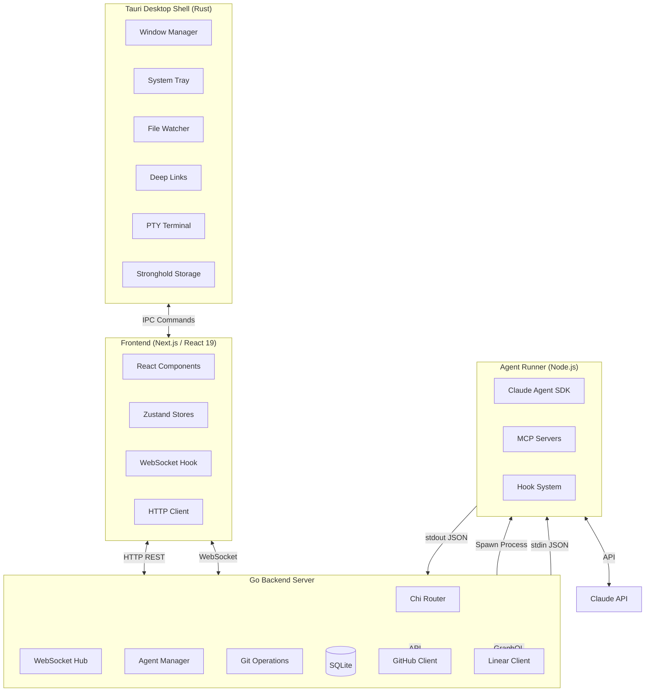
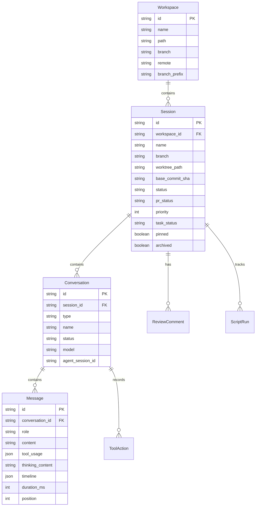

# ChatML Application Overview

## What Is ChatML

ChatML is a native desktop application for AI-assisted software development. It wraps Anthropic's Claude Agent SDK into a polished desktop experience, enabling developers to work on coding tasks with Claude as a full-featured coding partner. The application provides isolated coding sessions through git worktrees, real-time streaming of Claude's responses and tool execution, and deep integration with GitHub and Linear.

ChatML is a **polyglot application** spanning four languages and runtimes:

- **TypeScript/React** — The user interface, built with Next.js 16 and React 19
- **Go** — The backend server, handling REST API, WebSocket, git operations, and process management
- **Rust** — The Tauri 2 desktop shell, providing native window management, secure storage, and system integration
- **Node.js/TypeScript** — The agent runner, wrapping the Claude Agent SDK for multi-turn AI conversations

The application runs entirely on the developer's local machine. There is no cloud server or SaaS component beyond the Claude API itself. All data is stored locally in SQLite, all git operations happen on local repositories, and all communication happens over localhost.

---

## The Core Concept: Git Worktree Sessions

The fundamental design principle of ChatML is **session isolation through git worktrees**. Every coding session gets its own git worktree — a fully isolated copy of the repository with its own branch, working directory, and index. This means:

- **Parallel work**: A developer can have multiple AI coding sessions running simultaneously on the same repository without branch conflicts
- **Safe experimentation**: Each session operates in isolation. If Claude makes unwanted changes, they don't affect the main repository or other sessions
- **Clean branches**: Each session creates a dedicated branch, making it easy to create pull requests from completed work

Sessions are stored at `~/.chatml/workspaces/<session-name>/` (or the configured workspaces base directory). The session names are auto-generated from a pool of constellation and city names, giving each workspace a memorable identifier. When a name collides with an existing session, the system retries with different names, and as a last resort appends a random suffix.

```
<workspaces-base-dir>/
├── orion/                   # Session worktree
│   ├── .git                 # File pointing to main repo's .git
│   ├── src/                 # Full repository contents
│   └── ...
├── cassiopeia/              # Another session
│   ├── .git
│   └── ...
└── lyra/                    # And another
    ├── .git
    └── ...
```

Each worktree's `.git` is a **file** (not a directory) that contains a pointer back to the main repository's `.git/worktrees/` directory. This is how git worktrees share the object database while maintaining separate working trees.

---

## Architecture Overview

ChatML's architecture consists of four layers that communicate through well-defined interfaces:



### The Frontend Layer

The frontend is a **Next.js 16 application** using the App Router, built with React 19, Tailwind CSS 4, and Zustand 5 for state management. It is exported as **static HTML** (no Node.js server at runtime) and served directly by Tauri's webview.

Key technologies:
- **Zustand 5** — Lightweight state management with 12+ stores for different concerns
- **Monaco Editor** — Full VS Code editor experience for viewing and editing files
- **xterm.js** — Terminal emulation with PTY support for interactive shell sessions
- **Shiki** — Syntax highlighting for code blocks in conversations
- **Radix UI / shadcn/ui** — Accessible component primitives with the New York style variant
- **Plate.js** — Rich text editor capabilities
- **react-virtuoso** — Virtual scrolling for large message lists

The frontend communicates with the Go backend via HTTP REST for data operations and WebSocket for real-time streaming. It communicates with the Tauri shell via IPC commands for native capabilities like file dialogs, clipboard, and notifications.

### The Go Backend Layer

The backend is a **Go server** built with the chi/v5 HTTP router. It runs as a sidecar process spawned by Tauri and listens on localhost (port 9876, with fallback to 9877-9899 if the port is busy).

Responsibilities:
- **REST API** — Full CRUD for workspaces, sessions, conversations, messages, and settings
- **WebSocket Hub** — Broadcasting real-time events to all connected frontend clients
- **Agent Management** — Spawning, monitoring, and communicating with agent-runner processes
- **Git Operations** — Worktree creation/deletion, branch management, diff computation
- **GitHub Integration** — OAuth, PR creation, CI/CD status, issue tracking
- **Linear Integration** — OAuth, issue tracking, branch creation from issues
- **SQLite Persistence** — All data stored in a local SQLite database with WAL mode

The backend uses gorilla/websocket for WebSocket connections and modernc.org/sqlite for the database (a pure-Go SQLite implementation that requires no CGo).

### The Agent Runner Layer

The agent runner is a **Node.js TypeScript process** that wraps the Anthropic Claude Agent SDK. The Go backend spawns one agent-runner process per active conversation. The two communicate via **JSON lines over stdin/stdout** — the backend sends user messages and control commands on stdin, and the agent runner emits streaming events on stdout.

The agent runner uses a **persistent multi-turn architecture**: a single `query()` call to the SDK lasts for the entire session. An async generator yields user messages across turns, so there's no subprocess restart between messages. This means MCP connections stay alive, session state persists naturally, and there's no need for `--resume` between turns.

### The Tauri Desktop Shell Layer

Tauri 2 (Rust) provides the native desktop wrapper. It transforms the static Next.js output into a native macOS/Windows/Linux application with:

- **Window management** — Native titlebar, traffic light positioning, window state persistence
- **System tray** — Quick actions menu with Show/Hide, New Session, Quit
- **File watcher** — Monitors the workspaces directory for external changes
- **Deep links** — Handles `chatml://` protocol URLs for OAuth callbacks
- **PTY terminal** — Pseudo-terminal support for xterm.js integration
- **Stronghold** — Encrypted credential storage using Argon2id key derivation
- **Auto-updater** — Checks GitHub releases for updates with signature verification
- **Notifications** — Native OS notifications for task completion and agent questions
- **Clipboard** — Read/write system clipboard
- **Single instance** — Prevents multiple app instances

---

## Communication Patterns

### Frontend to Backend (HTTP + WebSocket)

The frontend communicates with the Go backend over **localhost** using two protocols:

**HTTP REST** — Used for all data operations: fetching workspaces, creating sessions, loading messages, saving files, managing settings. Every request includes a Bearer token generated by Tauri at startup.

**WebSocket** — Used for real-time streaming of agent events. The frontend opens a single WebSocket connection at `ws://localhost:{port}/ws?token={authToken}` and receives all events for all conversations. The WebSocket supports automatic reconnection with exponential backoff.

### Backend to Agent Runner (stdin/stdout)

The Go backend communicates with each agent-runner process via **JSON lines on stdio**:

**stdin** (Backend → Agent): User messages, stop/interrupt signals, model changes, permission mode changes, user question responses, plan approvals, and file rewind requests.

**stdout** (Agent → Backend): Streaming text, tool execution events, thinking blocks, session lifecycle events, budget tracking, checkpoint creation, and error notifications. Each line is a complete JSON object.

**stderr** (Agent → Backend): Diagnostic output and SDK debug logs. The last 10 lines are captured in a ring buffer for crash diagnostics.

### Agent Runner to Claude API

The agent runner communicates with the Claude API through the Claude Agent SDK. The SDK manages the conversation history, tool registration, system prompts, and streaming. The agent runner configures the SDK with the `claude_code` tool preset, which provides Read, Write, Edit, Glob, Grep, Bash, WebFetch, WebSearch, and other development tools.

---

## Key Features

### Workspace Management

Users add git repositories as **workspaces** through a folder picker dialog. Each workspace represents one git repository that can host multiple sessions. Workspace settings include:

- **Branch prefix strategy** — How session branch names are prefixed (GitHub username, custom string, or none)
- **Default branch** — The base branch for new sessions (main, master, or custom)
- **MCP servers** — Per-workspace MCP server configurations
- **PR template** — Custom pull request description template
- **Setup scripts** — Commands to run when creating new sessions (e.g., `npm install`)

### Session System

Sessions are the primary unit of work. Each session creates:
- A **git worktree** with its own branch
- One or more **conversations** (AI chat threads)
- **File tabs** scoped to the session
- **Terminal instances** (1-5 per session)
- Tracking for **PR status**, **CI checks**, and **file changes**

Sessions have rich metadata: priority (Urgent/High/Medium/Low), task status (Backlog/In Progress/In Review/Done/Cancelled), pinning, and archiving with summaries. They can be created from scratch, from existing branches, or from pull request URLs.

### Multi-Turn Conversations

Each session can have multiple conversations of different types:
- **Task** — The primary coding conversation with Claude
- **Review** — Code review conversations
- **Chat** — General discussion conversations

Conversations support multi-turn interaction where Claude maintains context across messages. The SDK session ID is persisted so conversations can be resumed even after process restarts.

### Real-Time Streaming

Claude's responses stream in real-time through a multi-layer pipeline:

1. The Claude API generates tokens
2. The agent runner receives them via the SDK and buffers text at paragraph boundaries
3. Events are emitted as JSON lines on stdout
4. The Go backend parses events, builds streaming snapshots, and broadcasts via WebSocket
5. The frontend receives events and renders them incrementally

Text and tool executions are **interleaved in a timeline** — you see exactly when Claude read a file, made an edit, or ran a command relative to its text output.

### Tool Execution Tracking

Every tool Claude uses is tracked in real-time:
- **tool_start** — Shows which tool is executing with its parameters
- **tool_progress** — Displays elapsed time for long-running operations
- **tool_end** — Shows the result (success/failure) with a summary

Tools include file reads, writes, edits, bash commands, web searches, and glob/grep operations. Each tool execution is timed and recorded in the message's tool usage array.

### Sub-Agent Support

Claude can spawn child agents using the Task tool. These sub-agents are tracked hierarchically — each sub-agent has its own ID, and its tool executions are attributed to it rather than the parent agent. The frontend shows sub-agent activity nested under the parent Task tool call.

### Extended Thinking

When enabled, Claude's reasoning process is visible in collapsible thinking blocks. The thinking content streams in real-time alongside the regular response text.

### Plan Mode

Claude can propose plans before executing them. In plan mode:
1. Claude analyzes the task and writes a plan
2. The plan is presented to the user with Approve/Reject buttons
3. Only after approval does Claude proceed with execution

This is useful for complex tasks where you want to review the approach before changes are made.

### File Browser and Editor

The application includes a Monaco-based code editor with:
- **File tabs** — Scoped to the current session, with dirty tracking
- **Diff viewer** — Side-by-side diffs for changed files
- **File tree** — Browse the session's worktree
- **Auto-save** — Automatically saves changes after a delay

### Terminal Integration

Full terminal emulation via xterm.js with PTY support:
- Interactive shell sessions in the session's worktree
- Multiple terminal instances per session (up to 5)
- Standard terminal features (search, fit-to-container, color support)

### GitHub Integration

- **OAuth authentication** — Login with GitHub for API access
- **PR creation** — Create pull requests from sessions with AI-generated descriptions
- **CI/CD monitoring** — View workflow runs, job logs, and check statuses
- **Issue tracking** — Search and view GitHub issues
- **PR status tracking** — Automatic polling detects PR merges, closes, and CI status changes

### Linear Integration

- **OAuth authentication** — Login with Linear for issue management
- **Issue tracking** — Link sessions to Linear issues
- **Branch creation** — Create branches named after Linear issues

### Skills System

A unified command system with 25+ built-in skills organized into categories:
- **Development** — TDD workflow, unit testing, debugging, code review, API design, refactoring, performance optimization
- **Security** — Security audit, dependency review
- **Documentation** — Brainstorming, writing plans, architecture decision records, technical writing
- **Version Control** — Git commit helper, PR creation, branch management, code migration

Skills are activated via slash commands (e.g., `/tdd-workflow`) and inject specialized guidance into the conversation. Users can also create custom commands by placing `.md` files in `.claude/commands/`.

### MCP Support

Model Context Protocol (MCP) servers extend Claude's capabilities:
- **Built-in ChatML server** — Provides workspace-aware tools (git status, diff, review comments, scripts)
- **Project-level servers** — Configured via `.mcp.json` in the repository
- **User-configured servers** — Managed through the settings UI
- Supports **stdio**, **SSE**, and **HTTP** transport types

### Budget Tracking

Per-conversation budget tracking with three dimensions:
- **Cost** — Total USD spent (from Claude API usage)
- **Turns** — Number of conversation turns
- **Thinking tokens** — Extended thinking token usage

Each dimension can have a maximum limit. The Budget panel shows real-time usage with progress bars, and the system stops execution when limits are reached.

### File Checkpointing

The SDK creates file checkpoints at turn boundaries, allowing users to **rewind** file changes to any previous state within the session. This is valuable when Claude makes unwanted modifications — instead of manually reverting, you can restore files to a specific checkpoint.

### Branch Sync

The application monitors each session's git HEAD file via filesystem watchers. When a branch change is detected (from the user's IDE or terminal), the session automatically updates its display. The monitoring also detects index changes to trigger file stats recomputation.

### PR Status Tracking

Sessions with open pull requests are monitored with a two-tier polling strategy:
- Sessions without PR: Checked every 30 seconds for new PR detection
- Sessions with open PR: Checked every 2 minutes for status changes

The system tracks PR state (open/merged/closed), CI check status (pending/success/failure), and mergeability. Status changes are broadcast via WebSocket and update the session display in real-time.

---

## The Multi-Tab Interface

ChatML uses a browser-like multi-tab interface where each tab can display different content views:

- **Conversation** — Chat with Claude in a specific session
- **Global Dashboard** — Overview of all workspaces and sessions
- **Workspace Dashboard** — Focused view of a single workspace's sessions
- **PR Dashboard** — Pull request status across all workspaces
- **Branches** — Branch management for a workspace
- **Repositories** — Add and manage git repositories
- **Session Manager** — Data table view of all sessions with filtering and sorting
- **Skills Store** — Browse and install available skills

Tabs persist across sessions and can be reordered via drag-and-drop.

---

## Settings System

User preferences are persisted via Zustand middleware to localStorage:

### Chat Settings
- **Default model** — Which Claude model to use (default: claude-opus-4-6)
- **Thinking mode** — Whether extended thinking is enabled by default
- **Max thinking tokens** — Token budget for extended thinking (default: 10,000)
- **Sound effects** — Audio feedback for events

### Appearance Settings
- **Theme** — System, Light, or Dark mode
- **Editor theme** — Monaco editor color scheme
- **Font size** — Editor font size
- **Zen mode** — Distraction-free interface

### Git Settings
- **Branch prefix** — Strategy for branch naming (GitHub username, custom, none)
- **Custom prefix** — Custom string for branch names
- **Archive on merge** — Auto-archive sessions when PR is merged

### Panel Layout
- **Resizable panels** — Outer, inner, vertical, and changes panel sizes are persisted
- **Panel visibility** — Left sidebar, right sidebar, terminal, thinking visibility
- **Bottom panel tabs** — Which tabs are visible (todos, plans, scripts, history, budget, MCP)

---

## Security Model

### Authentication
- A 32-byte cryptographically random token is generated at app startup
- Encoded as URL-safe base64 (43 characters)
- Passed to the Go backend via the `CHATML_AUTH_TOKEN` environment variable
- Every HTTP request includes this token as a Bearer token
- WebSocket connections require the token as a query parameter

### Content Security Policy
The CSP restricts connections to localhost ports 9876-9899, preventing the webview from contacting external servers. Images allow data URIs and blobs for canvas-generated content.

### Encrypted Storage
Sensitive credentials are stored in Tauri's Stronghold plugin, which uses Argon2id key derivation (4MB memory, 1 iteration) with a fixed application-specific salt.

### Process Isolation
Each agent-runner process runs in its own worktree directory. Tool presets can restrict which tools are available (read-only, no-bash, safe-edit, or full access).

### Path Protection
File operations validate paths to prevent traversal attacks. Protected branches (main, master, develop) cannot be used for session branches. Git ref names are validated with a strict regex pattern.

---

## Data Model

The application uses a hierarchical data model persisted in SQLite:



---

## Development Workflow

### Prerequisites
- Node.js 20+
- Go 1.25+
- Rust 1.77+
- Tauri CLI

### Running in Development

```bash
make dev
# Builds Go backend + agent-runner, then starts Tauri dev with Next.js on port 3100
```

### Building for Production

```bash
make build
# Go build with release flags + agent-runner + Tauri native app bundle
```

### Testing

```bash
npm run test          # Watch mode
npm run test:run      # Single run
npm run test:coverage # Coverage report (20% minimum threshold)
```

---

## Cross-References

- **Git Worktrees & Sessions**: See [git-worktrees.md](./git-worktrees.md)
- **Agent SDK Integration**: See [agent-sdk.md](./agent-sdk.md)
- **Streaming Events**: See [claude-sdk-events.md](./claude-sdk-events.md)
- **Skills & Commands**: See [skills-and-commands.md](./skills-and-commands.md)
- **Tauri Desktop Shell**: See [tauri-desktop.md](./tauri-desktop.md)
- **Backend API**: See [backend-api.md](./backend-api.md)
- **WebSocket Streaming**: See [websocket-streaming.md](./websocket-streaming.md)
- **Frontend Rendering**: See [frontend-rendering.md](./frontend-rendering.md)
- **Data Models**: See [data-models-persistence.md](./data-models-persistence.md)
- **Session Management**: See [session-management.md](./session-management.md)
- **Conversation Architecture**: See [conversation-architecture.md](./conversation-architecture.md)
