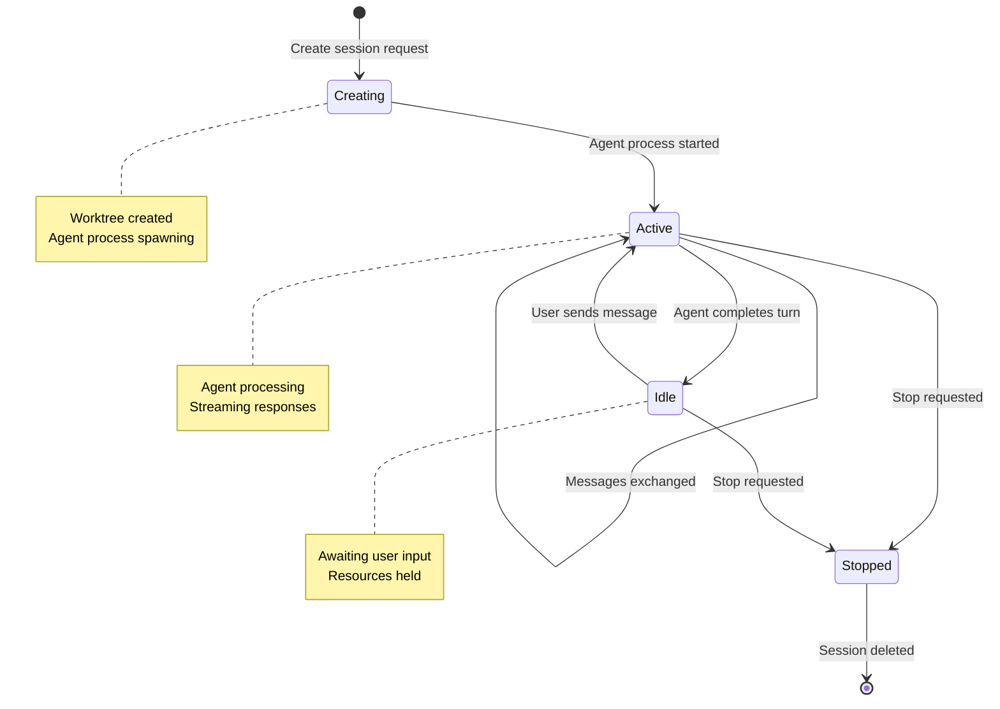
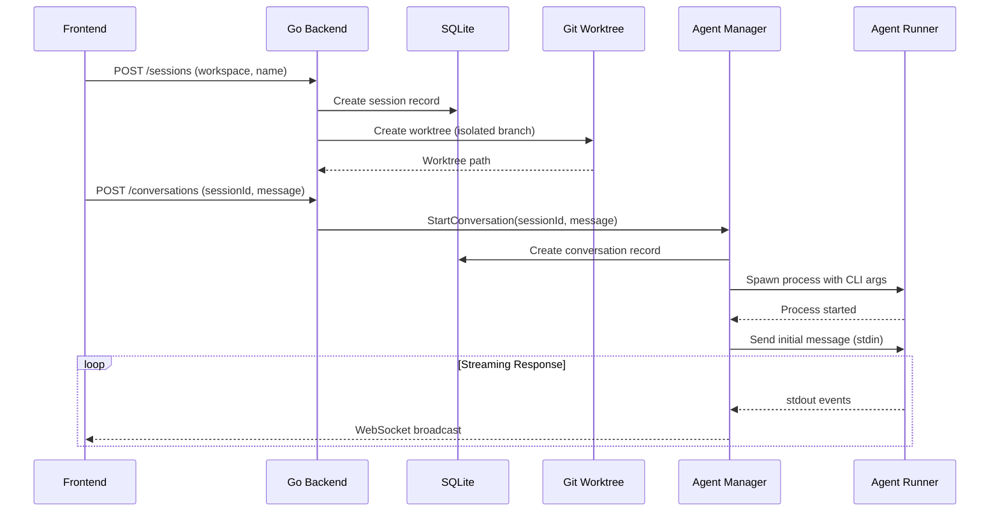
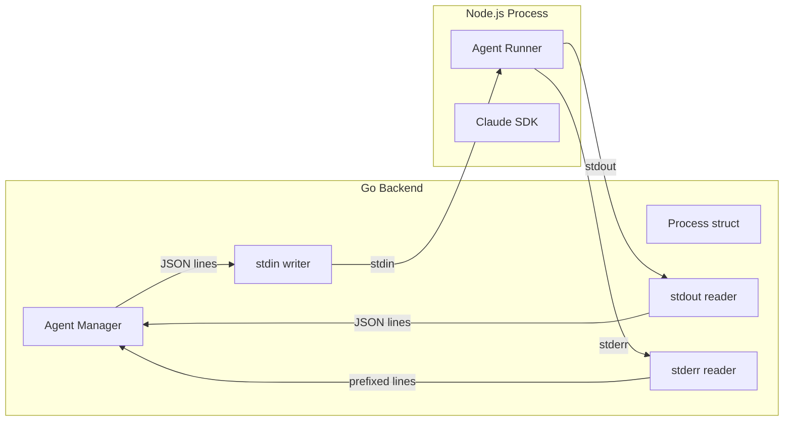
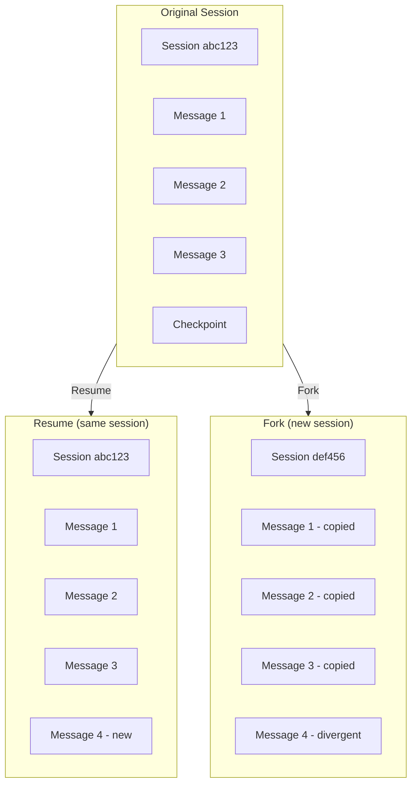
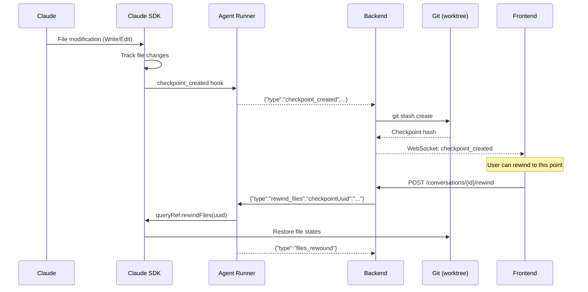
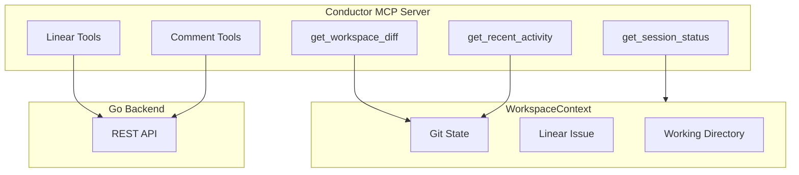
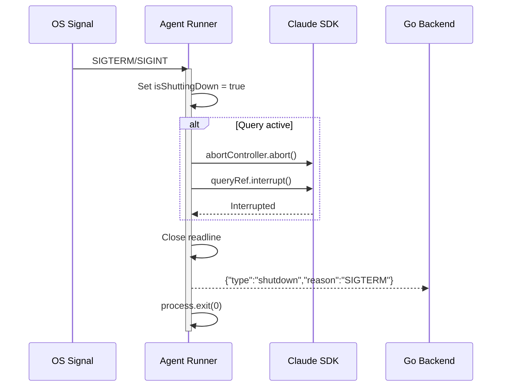
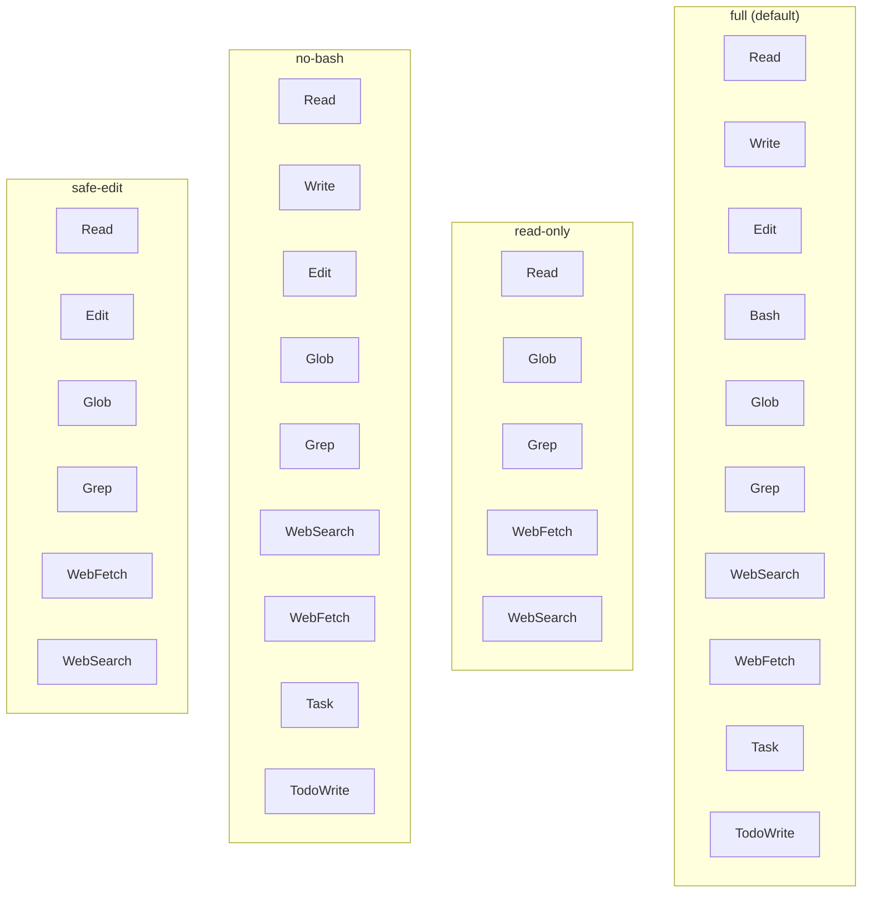

# Session Management Architecture

This document covers session lifecycle management, including session creation, agent process spawning, conversation resume/fork capabilities, and file checkpointing.

## Table of Contents

1. [Session Lifecycle](#session-lifecycle)
2. [Agent Process Management](#agent-process-management)
3. [Session Resume & Fork](#session-resume--fork)
4. [File Checkpointing](#file-checkpointing)
5. [MCP Integration](#mcp-integration)
6. [Graceful Shutdown](#graceful-shutdown)

## Session Lifecycle

### Session State Machine



### Session Creation Flow



## Agent Process Management

### Process Options

**File: `backend/agent/process.go:32-50`**

```go
type ProcessOptions struct {
    ID                  string      // Unique process identifier
    Workdir             string      // Worktree path
    ConversationID      string      // Associated conversation
    ResumeSession       string      // Session ID to resume from
    ForkSession         bool        // Fork from existing session
    LinearIssue         string      // Linear issue (e.g., "LIN-123")
    ToolPreset          string      // Tool restrictions
    EnableCheckpointing bool        // File checkpoint support
    MaxBudgetUsd        float64     // Cost limit
    MaxTurns            int         // Turn limit
    MaxThinkingTokens   int         // Extended thinking budget
    StructuredOutput    string      // JSON schema for output
    SettingSources      string      // "project,user,local"
    Betas               string      // Beta features
    Model               string      // Model override
    FallbackModel       string      // Fallback model
}
```

### CLI Arguments Construction

**File: `backend/agent/process.go:115-179`**

```mermaid
flowchart TB
    Options[ProcessOptions]
    Base[node agent-runner/dist/index.js]
    CWD[--cwd workdir]
    Conv[--conversation-id uuid]

    subgraph Optional["Optional Arguments"]
        Resume[--resume sessionId]
        Fork[--fork]
        Linear[--linear-issue LIN-123]
        Preset[--tool-preset full|read-only]
        Checkpoint[--enable-checkpointing]
        Budget[--max-budget-usd N]
        Turns[--max-turns N]
        Thinking[--max-thinking-tokens N]
        Output[--structured-output schema]
        Settings[--setting-sources project,user]
        Betas[--betas features]
        Model[--model claude-sonnet-4]
        Fallback[--fallback-model claude-haiku]
    end

    Options --> Base
    Base --> CWD
    CWD --> Conv
    Conv --> Optional
```

### Process Communication



### Input/Output Protocol

**Input Messages (stdin)**
```json
{"type":"message","content":"Implement feature X"}
{"type":"stop"}
{"type":"interrupt"}
{"type":"set_model","model":"claude-opus-4"}
{"type":"rewind_files","checkpointUuid":"chk_123"}
```

**Output Events (stdout)**
```json
{"type":"ready"}
{"type":"assistant_text","content":"I'll start by..."}
{"type":"tool_start","id":"t1","tool":"Read","params":{}}
{"type":"tool_end","id":"t1","success":true}
{"type":"result","success":true,"cost":0.02}
```

### Buffer Management

**File: `backend/agent/process.go:196-242`**

```go
// Output channel buffer
outputChan := make(chan OutputLine, 1000)

// Large JSON support
const maxLineSize = 10 * 1024 * 1024  // 10MB

// Consumer timeout
const consumerTimeout = 5 * time.Second
```

## Session Resume & Fork

### Resume vs Fork



### Resume Implementation

**File: `agent-runner/src/index.ts:42-52, 530-531`**

```typescript
// CLI argument parsing
const resumeIndex = args.indexOf("--resume");
const resumeSessionId = resumeIndex !== -1 ? args[resumeIndex + 1] : undefined;

// Query configuration
const result = await query(stream, {
  resume: resumeSessionId,
  // ...other options
});
```

### Fork Implementation

```typescript
// CLI argument parsing
const forkIndex = args.indexOf("--fork");
const forkSession = forkIndex !== -1;

// Query configuration (fork requires resume ID)
const result = await query(stream, {
  resume: resumeSessionId,
  forkSession: forkSession && !!resumeSessionId,
  // ...other options
});
```

### Session Source Types

**File: `agent-runner/src/index.ts:422`**

```typescript
type SessionSource =
  | "startup"   // New session
  | "resume"    // Resumed existing session
  | "clear"     // Session cleared/reset
  | "compact";  // Context compaction created new session
```

## File Checkpointing

### Checkpoint Flow



### Checkpoint Event Structure

```typescript
{
  type: "checkpoint_created",
  uuid: "chk_01ABC123",
  timestamp: "2025-01-15T10:30:00Z",
  files: [
    { path: "src/app.ts", action: "modified" },
    { path: "src/utils.ts", action: "created" },
    { path: "old-file.ts", action: "deleted" }
  ]
}
```

### Rewind Implementation

**File: `agent-runner/src/index.ts:207-214`**

```typescript
// Handle rewind request from stdin
if (parsed.type === "rewind_files") {
  if (queryRef && parsed.checkpointUuid) {
    await queryRef.rewindFiles(parsed.checkpointUuid);
    emit({ type: "files_rewound", checkpointUuid: parsed.checkpointUuid });
  }
  return;
}
```

**Backend Handler: `backend/server/handlers.go:2048-2079`**

```go
func (h *Handlers) RewindConversation(w http.ResponseWriter, r *http.Request) {
    convID := chi.URLParam(r, "convId")

    var req struct {
        CheckpointUuid string `json:"checkpointUuid"`
    }
    json.NewDecoder(r.Body).Decode(&req)

    err := h.agentManager.RewindConversationFiles(convID, req.CheckpointUuid)
    if err != nil {
        http.Error(w, err.Error(), http.StatusInternalServerError)
        return
    }

    w.WriteHeader(http.StatusOK)
}
```

## MCP Integration

### Conductor MCP Server

**File: `agent-runner/src/mcp/server.ts:12-114`**



### MCP Tools

| Tool | Purpose | Parameters |
|------|---------|------------|
| `get_session_status` | Current session info | - |
| `get_workspace_diff` | Git diff from base | `detailed: boolean` |
| `get_recent_activity` | Recent commits | `limit: number` |
| `add_review_comment` | Add code comment | `file`, `line`, `content` |
| `list_review_comments` | List comments | `file?: string` |
| `get_review_comment_stats` | Comment statistics | - |

### Workspace Context

**File: `agent-runner/src/mcp/context.ts:30-46`**

```typescript
class WorkspaceContext {
  readonly cwd: string;
  readonly workspaceId: string;
  readonly sessionId: string;
  private _linearIssue: LinearIssue | null = null;
  private _gitState: GitState | null = null;

  get gitState(): GitState {
    return {
      branch: string,           // Current branch
      baseBranch: string,       // main/origin/main
      uncommittedChanges: bool, // Dirty state
      aheadBy: number,          // Commits ahead
      behindBy: number          // Commits behind
    };
  }
}
```

### Linear Issue Resolution

**File: `agent-runner/src/mcp/context.ts:104-148`**

```mermaid
flowchart TB
    Start[Resolve Linear Issue]
    CLI{CLI argument?}
    Branch{Branch pattern?}
    Commits{Recent commits?}
    Found[Issue found]
    NotFound[No issue]

    Start --> CLI
    CLI -->|Yes| Found
    CLI -->|No| Branch
    Branch -->|Match LIN-123| Found
    Branch -->|No match| Commits
    Commits -->|Match [A-Z]+-\d+| Found
    Commits -->|No match| NotFound
```

Priority order:
1. Explicit CLI: `--linear-issue LIN-123`
2. Branch name: `feat/LIN-123-description`
3. Recent commits: `git log -5` matches `[A-Z]+-\d+`

## Graceful Shutdown

### Shutdown Flow

**File: `agent-runner/src/index.ts:869-928`**



### Cleanup Implementation

```typescript
let cleanupCalled = false;
let isShuttingDown = false;

async function cleanup(reason: string): Promise<void> {
  if (cleanupCalled) return;
  cleanupCalled = true;

  // 1. Abort pending operations
  if (abortControllerRef) {
    abortControllerRef.abort();
  }

  // 2. Interrupt SDK query
  if (queryRef) {
    try {
      await queryRef.interrupt();
    } catch {
      // Ignore shutdown errors
    }
  }

  // 3. Close readline
  closeReadline();

  // 4. Emit shutdown event
  emit({ type: "shutdown", reason });
}

// Signal handlers
process.on("SIGTERM", () => {
  if (isShuttingDown) return;
  isShuttingDown = true;
  cleanup("SIGTERM").finally(() => process.exit(0));
});

process.on("SIGINT", () => {
  if (isShuttingDown) return;
  isShuttingDown = true;
  cleanup("SIGINT").finally(() => process.exit(0));
});
```

### Backend Process Termination

**File: `backend/agent/manager.go`**

```go
func (m *Manager) StopConversation(convID string) error {
    m.mu.Lock()
    proc, exists := m.convProcesses[convID]
    m.mu.Unlock()

    if !exists {
        return nil
    }

    // Send stop message
    proc.SendMessage(InputMessage{Type: "stop"})

    // Wait for graceful shutdown (with timeout)
    select {
    case <-proc.Done():
        // Process exited cleanly
    case <-time.After(5 * time.Second):
        // Force kill
        proc.Kill()
    }

    return nil
}
```

## Tool Presets

### Preset Configurations

**File: `agent-runner/src/index.ts:28-40`**

```typescript
function resolveToolPreset(preset: string): ToolConfig {
  switch (preset) {
    case "read-only":
      return {
        allowedTools: ["Read", "Glob", "Grep", "WebFetch", "WebSearch"]
      };
    case "no-bash":
      return {
        disallowedTools: ["Bash"]
      };
    case "safe-edit":
      return {
        allowedTools: ["Read", "Glob", "Grep", "Edit", "WebFetch", "WebSearch"]
      };
    case "full":
    default:
      return {};  // All tools enabled
  }
}
```

### Preset Comparison



## Related Documentation

- [Conversation Architecture Overview](./conversation-architecture.md)
- [Data Models & Persistence](./data-models-persistence.md)
- [Claude SDK Events](./claude-sdk-events.md)
- [WebSocket Streaming](./websocket-streaming.md)
