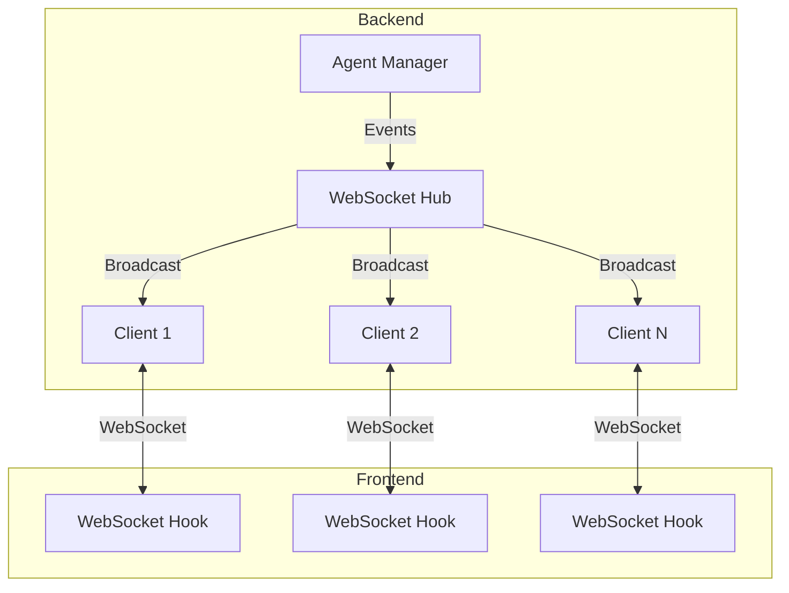
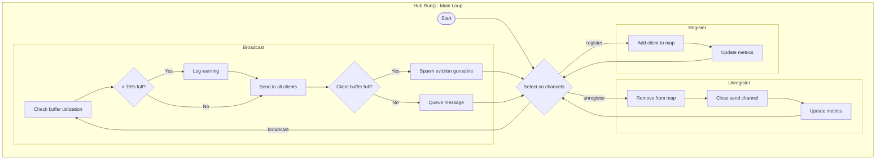
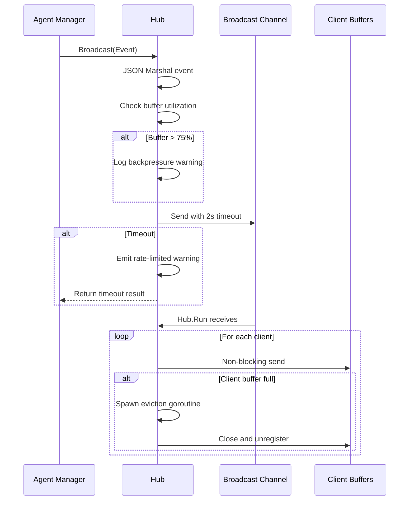
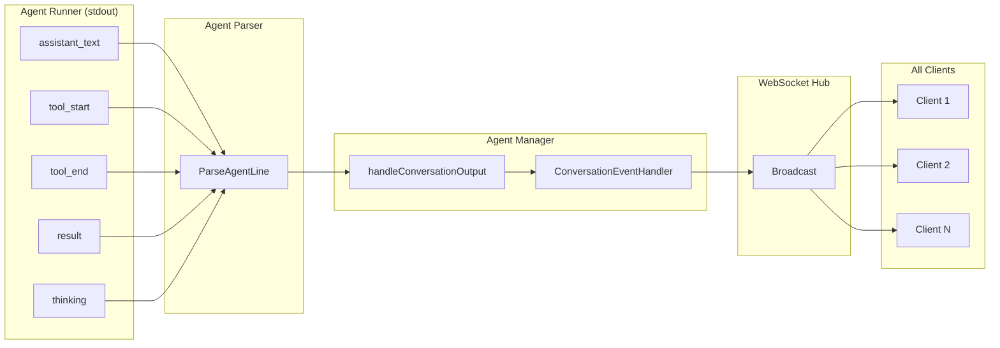
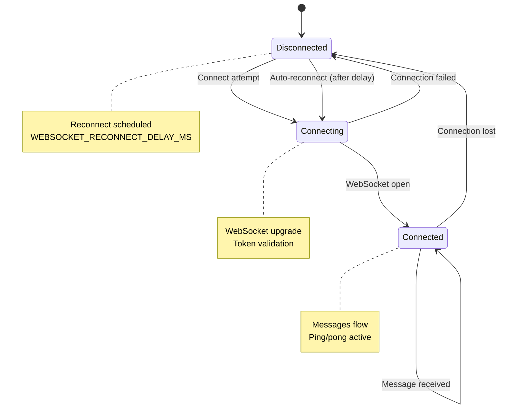
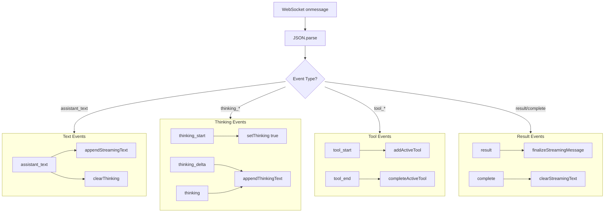
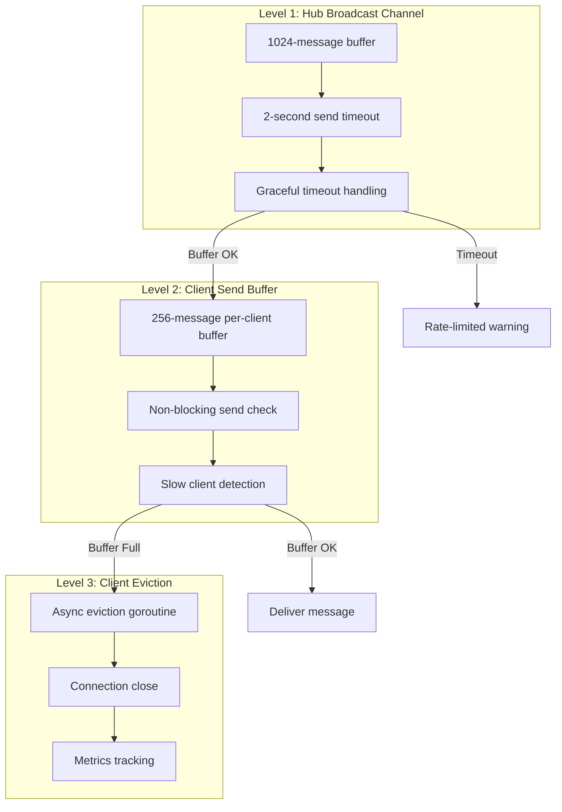
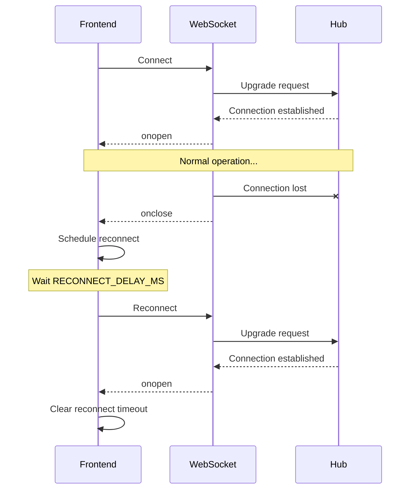
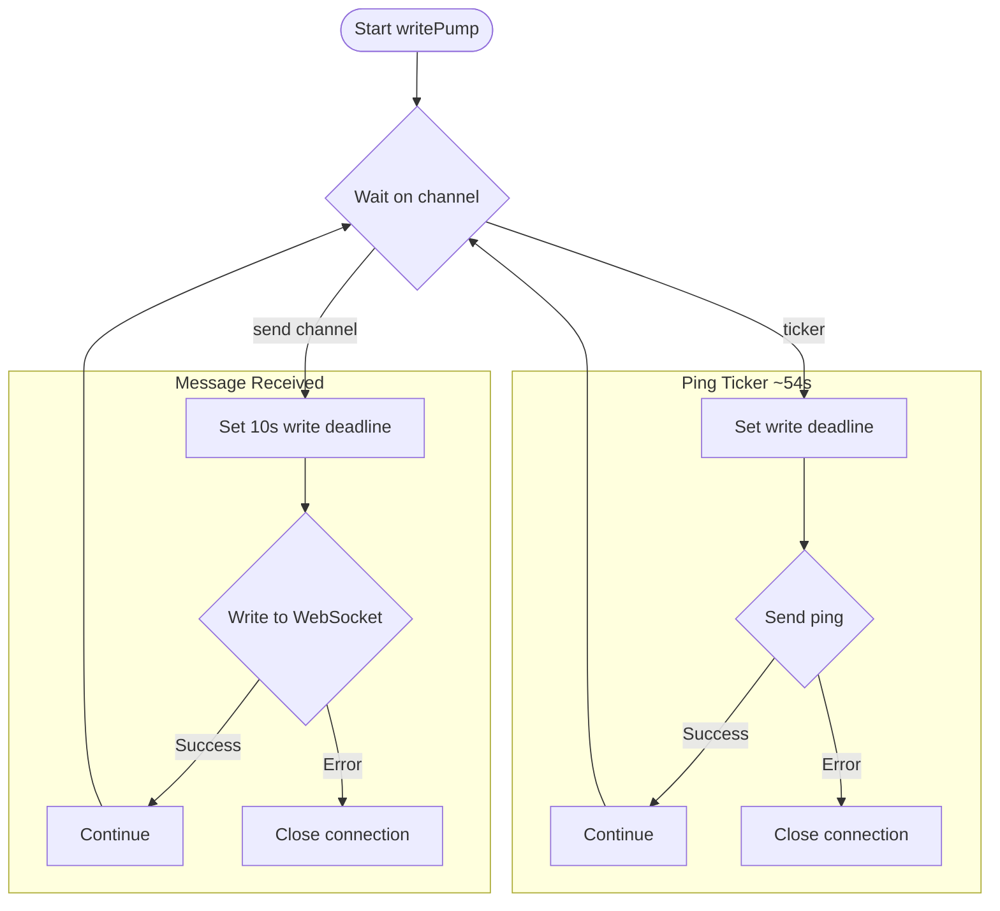

# WebSocket Streaming Architecture

This document covers the real-time WebSocket streaming system, including the backend Hub architecture, frontend connection handling, event flow, and backpressure management.

## Table of Contents

1. [Architecture Overview](#architecture-overview)
2. [WebSocket Hub](#websocket-hub)
3. [Event Types](#event-types)
4. [Frontend Connection](#frontend-connection)
5. [Backpressure Management](#backpressure-management)
6. [Error Handling](#error-handling)

## Architecture Overview

ChatML uses a hub-and-spoke WebSocket architecture where a central Hub broadcasts events to all connected clients.



## WebSocket Hub

### Hub Structure

**File: `backend/server/websocket.go:107-127`**

```go
type Hub struct {
    clients         map[*Client]bool        // Connected clients
    broadcast       chan []byte             // Pre-serialized JSON (buffer: 1024)
    register        chan *Client            // New client registration
    unregister      chan *Client            // Client disconnection (buffer: 64)
    mu              sync.RWMutex
    metrics         *HubMetrics
    lastWarningTime atomic.Int64            // Rate-limit warning emissions
}

type Client struct {
    hub  *Hub
    conn *websocket.Conn
    send chan []byte     // Buffered channel (256 messages)
}
```

### Event Structure

**File: `backend/server/websocket.go:42-48`**

```go
type Event struct {
    Type           string      `json:"type"`
    AgentID        string      `json:"agentId,omitempty"`
    SessionID      string      `json:"sessionId,omitempty"`
    ConversationID string      `json:"conversationId,omitempty"`
    Payload        interface{} `json:"payload,omitempty"`
}
```

### Hub Run Loop



### Broadcast Flow

**File: `backend/server/websocket.go:203-262`**



## Event Types

### Complete Event Catalog

| Event Type | Source | Direction | Description |
|------------|--------|-----------|-------------|
| `init` | Agent | Hub → Client | SDK initialization with model/tools info |
| `assistant_text` | Agent | Hub → Client | Streamed response text |
| `thinking_start` | Agent | Hub → Client | Extended thinking began |
| `thinking_delta` | Agent | Hub → Client | Thinking text chunk |
| `thinking` | Agent | Hub → Client | Complete thinking block |
| `tool_start` | Agent | Hub → Client | Tool execution started |
| `tool_end` | Agent | Hub → Client | Tool execution completed |
| `tool_progress` | Agent | Hub → Client | Tool still executing |
| `todo_update` | Agent | Hub → Client | TodoWrite tool executed |
| `name_suggestion` | Agent | Hub → Client | AI-suggested conversation name |
| `result` | Agent | Hub → Client | Final result with stats |
| `complete` | Agent | Hub → Client | Stream completed |
| `error` | Agent | Hub → Client | Execution error |
| `conversation_status` | Manager | Hub → Client | Status change (active/idle/completed) |
| `checkpoint_created` | Agent | Hub → Client | File checkpoint saved |
| `permission_mode_changed` | Agent | Hub → Client | Permission mode changed |
| `session_name_update` | Manager | Hub → Client | Session name changed |
| `session_stats_update` | Manager | Hub → Client | Session stats updated |
| `session_pr_update` | Manager | Hub → Client | PR status changed |
| `streaming_warning` | Hub | Hub → Client | Backpressure warning |

### Event Flow Diagram



## Frontend Connection

### WebSocket Hook

**File: `src/hooks/useWebSocket.ts`**

```typescript
// URL Construction (Lines 54-60)
const wsUrl = isTauri
  ? `ws://localhost:${port}/ws`
  : process.env.NEXT_PUBLIC_WS_URL || 'ws://localhost:9876/ws';

// Auth token appended (Line 351)
const urlWithAuth = `${wsUrl}?token=${authToken}`;
```

### Connection State Machine



### Frontend Event Handling

**File: `src/hooks/useWebSocket.ts:104-314`**



## Backpressure Management

### Three-Level Protection



### Warning Rate Limiting

**File: `backend/server/websocket.go`**

```go
// Backend: max 1 warning per 5 seconds
const warningCooldown = 5 * time.Second

func (h *Hub) emitBackpressureWarning() {
    now := time.Now().Unix()
    last := h.lastWarningTime.Load()
    if now-last < int64(warningCooldown.Seconds()) {
        return // Rate limited
    }
    if h.lastWarningTime.CompareAndSwap(last, now) {
        // Emit warning event
    }
}
```

**File: `src/components/StreamingWarningHandler.tsx:15-22`**

```typescript
// Frontend: max 1 toast per 10 seconds
const TOAST_COOLDOWN_MS = 10000;
let lastToastTime = 0;

function showWarning() {
    const now = Date.now();
    if (now - lastToastTime < TOAST_COOLDOWN_MS) return;
    lastToastTime = now;
    toast.warning('Streaming data may have been lost');
}
```

### Metrics Tracking

**File: `backend/server/websocket.go:59-105`**

```go
type HubMetrics struct {
    messagesDelivered     atomic.Uint64  // Successful transmissions
    messagesDropped       atomic.Uint64  // Clients removed due to slowness
    messagesTimedOut      atomic.Uint64  // Broadcast channel timeouts
    clientsDropped        atomic.Uint64  // Slow client disconnections
    broadcastBackpressure atomic.Uint64  // High buffer utilization events
    peakClients           atomic.Uint64  // Maximum concurrent connections
    currentClients        atomic.Uint64  // Active connections
}
```

## Error Handling

### Connection Error Recovery



### Client Write Pump

**File: `backend/server/websocket.go:312-351`**



### Client Read Pump

**File: `backend/server/websocket.go:355-381`**

```go
func (c *Client) readPump() {
    defer func() {
        c.hub.unregister <- c
        c.conn.Close()
    }()

    c.conn.SetReadLimit(512)  // Small limit - only pongs expected
    c.conn.SetReadDeadline(time.Now().Add(pongWait))  // 60 seconds
    c.conn.SetPongHandler(func(string) error {
        c.conn.SetReadDeadline(time.Now().Add(pongWait))
        return nil
    })

    for {
        if _, _, err := c.conn.ReadMessage(); err != nil {
            break  // Connection closed
        }
    }
}
```

## Performance Characteristics

| Metric | Value | Notes |
|--------|-------|-------|
| Hub broadcast buffer | 1024 messages | Pre-serialized JSON |
| Client send buffer | 256 messages | Per-client |
| Broadcast timeout | 2 seconds | Before warning |
| Ping interval | ~54 seconds | 90% of pong wait |
| Pong timeout | 60 seconds | Connection health |
| Write deadline | 10 seconds | Per message |
| Warning cooldown (backend) | 5 seconds | Rate limiting |
| Warning cooldown (frontend) | 10 seconds | Toast rate limiting |

## Related Documentation

- [Conversation Architecture Overview](./conversation-architecture.md)
- [Claude SDK Events](./claude-sdk-events.md)
- [Frontend Rendering Pipeline](./frontend-rendering.md)
